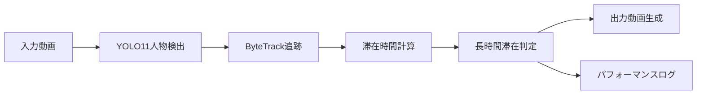

# 長時間滞在検出システム - 基本追跡版

**プロジェクト**: Human Activity Analyzer - 基本追跡システム  
**メインスクリプト**: `scripts/detect_long_stay.py`  
**更新日**: 2025年5月25日

## 📖 システム概要

このシステムは、動画から人物を検出・追跡し、**長時間同じ場所に滞在している人**を自動検出するソリューションです。

### 🎯 主な機能
- **人物検出**: YOLO11を使用した高精度な人物検出
- **追跡**: ByteTrackによる安定した人物追跡
- **長時間滞在検出**: 設定可能な閾値での滞在時間監視
- **リアルタイム処理**: 動画のリアルタイム分析と可視化
- **パフォーマンス監視**: 処理速度とシステムリソースの監視

### 🏗️ システム構成



---

## 🚀 クイックスタート

### 1. 最小構成での実行
```bash
python scripts/detect_long_stay.py --input data/sample.mp4 --output output/tracked.mp4
```

### 2. 推奨設定での実行
```bash
python scripts/detect_long_stay.py \
    --input data/raw/WIN_20250319_10_03_53_Pro.mp4 \
    --output output/enhanced_tracking.mp4 \
    --model yolo11n.pt \
    --enable_perf_log \
    --stay_threshold_sec 5.0 \
    --conf 0.3
```

---

## 📋 必要要件・依存関係

### システム要件
- **Python**: 3.8以上
- **OS**: Windows, macOS, Linux
- **RAM**: 4GB以上推奨
- **GPU**: CUDA対応GPU（任意、推奨）

### 必要なパッケージ
```bash
# 基本パッケージ
pip install ultralytics opencv-python psutil

# ByteTrack関連（既存プロジェクトに含まれている場合）
pip install boxmot

# YOLOモデル（自動ダウンロード）
# yolo11n.pt, yolov8n.pt等
```

### ディレクトリ構造の準備
```bash
mkdir -p data/raw output logs
```

---

## 🛠️ 詳細実行方法

### 基本コマンド構文
```bash
python scripts/detect_long_stay.py [必須引数] [オプション引数]
```

### 必須引数

| 引数 | 説明 | 例 |
|------|------|-----|
| `--input` | 入力動画ファイルのパス | `data/sample.mp4` |

### オプション引数

| 引数 | デフォルト | 説明 | 例 |
|------|------------|------|-----|
| `--output` | `output/tracked_video.mp4` | 出力動画ファイルのパス | `output/result.mp4` |
| `--model` | `yolov8n.pt` | YOLOモデルファイル | `yolo11n.pt` |
| `--enable_perf_log` | `False` | パフォーマンスログ有効化 | `--enable_perf_log` |
| `--enable_video_display` | `False` | リアルタイム動画表示 | `--enable_video_display` |
| `--device` | 自動選択 | 推論デバイス指定 | `cpu`, `mps`, `0` |
| `--stay_threshold_sec` | `5.0` | 長時間滞在判定閾値（秒） | `3.0`, `10.0` |
| `--move_threshold_px` | `30.0` | 移動判定閾値（ピクセル） | `20.0`, `50.0` |
| `--conf` | `0.3` | YOLO検出信頼度閾値 | `0.2`, `0.5` |

---

## 📚 実行例

### 1. 基本的な長時間滞在検出
```bash
python scripts/detect_long_stay.py \
    --input data/raw/video.mp4 \
    --output output/tracked_video.mp4
```

### 2. 高精度設定（5秒以上滞在を検出）
```bash
python scripts/detect_long_stay.py \
    --input data/raw/surveillance.mp4 \
    --output output/surveillance_tracked.mp4 \
    --model yolo11n.pt \
    --stay_threshold_sec 5.0 \
    --conf 0.4 \
    --enable_perf_log
```

### 3. リアルタイム監視モード
```bash
python scripts/detect_long_stay.py \
    --input data/raw/realtime.mp4 \
    --output output/realtime_tracked.mp4 \
    --enable_video_display \
    --stay_threshold_sec 3.0
```

### 4. GPU使用（高速処理）
```bash
python scripts/detect_long_stay.py \
    --input data/raw/large_video.mp4 \
    --output output/gpu_tracked.mp4 \
    --device 0 \
    --model yolo11s.pt \
    --enable_perf_log
```

### 5. 低感度設定（短時間滞在も検出）
```bash
python scripts/detect_long_stay.py \
    --input data/raw/quick_movement.mp4 \
    --output output/sensitive_tracked.mp4 \
    --stay_threshold_sec 2.0 \
    --move_threshold_px 15.0 \
    --conf 0.2
```

---

## 📊 出力結果

### 1. 追跡動画ファイル
- **ファイル**: 指定したoutputパス
- **内容**: 
  - 人物の検出・追跡結果
  - ID付きのバウンディングボックス
  - 滞在時間表示
  - 長時間滞在者のハイライト
  - リアルタイム統計情報

### 2. パフォーマンスログ（`--enable_perf_log`使用時）
- **ファイル**: `logs/log_[動画名]_long_stay_[モデル]_[日時].csv`
- **内容**:
  ```csv
  frame_idx,timestamp,detection_time_ms,tracking_time_ms,stay_check_time_ms,total_time_ms,num_detections,num_tracks,fps,memory_mb,model_name,tracker_name,config
  ```

### 3. コンソール出力例
```
入力動画: 1920x1080, 28.089349711378fps, 1369フレーム
進捗: 30/1369 (2.2%) | 処理速度: 31.47 FPS | 現在時刻: 21:03:45
Frame 820: 長時間滞在検出: ID 1 が 5.02秒間滞在しています
進捗: 1369/1369 (100.0%) | 処理速度: 31.47 FPS | 現在時刻: 21:04:30
処理完了。出力ファイル: output/tracked.mp4, ログ: logs/log_sample_long_stay_yolo11n_20250525.csv
```

---

## ⚙️ パラメータ調整ガイド

### 滞在時間閾値の調整
```bash
# 短時間滞在も検出（2秒）
--stay_threshold_sec 2.0

# 標準設定（5秒）
--stay_threshold_sec 5.0

# 長時間滞在のみ検出（10秒）
--stay_threshold_sec 10.0
```

### 移動感度の調整
```bash
# 高感度（小さな動きも移動と判定）
--move_threshold_px 10.0

# 標準設定
--move_threshold_px 30.0

# 低感度（大きな動きのみ移動と判定）
--move_threshold_px 50.0
```

### 検出精度の調整
```bash
# 高感度（多くの人を検出、誤検出も増加）
--conf 0.2

# バランス型（推奨）
--conf 0.3

# 高精度（確実な検出のみ、検出漏れ増加）
--conf 0.5
```

---

## 🎮 モデル選択ガイド

| モデル | 速度 | 精度 | 用途 |
|--------|------|------|------|
| `yolo11n.pt` | 最高速 | 標準 | リアルタイム処理 |
| `yolo11s.pt` | 高速 | 高 | バランス型 |
| `yolo11m.pt` | 中速 | 高精度 | 高品質処理 |
| `yolo11l.pt` | 低速 | 最高精度 | オフライン処理 |

### モデルの自動ダウンロード
初回実行時に指定したモデルが自動的にダウンロードされます：
```bash
# 初回実行時の出力例
Downloading https://github.com/ultralytics/assets/releases/download/v8.2.0/yolo11n.pt...
yolo11n.pt: 100%|██████████| 5.18M/5.18M [00:02<00:00, 2.31MB/s]
```

---

## 🔧 トラブルシューティング

### よくあるエラーと解決方法

#### 1. 入力ファイルが見つからない
```
エラー: 入力ファイルが見つかりません: data/sample.mp4
```
**解決方法**:
```bash
# ファイルパスを確認
ls data/raw/
# 正しいパスを指定
--input data/raw/correct_filename.mp4
```

#### 2. 動画ファイルを開けない
```
エラー: 動画ファイルを開けません: input.mp4
```
**解決方法**:
- 対応形式: MP4, AVI, MOV, MKV等
- コーデックが対応しているか確認
- ファイルが破損していないか確認

#### 3. メモリ不足
```
CUDA out of memory
```
**解決方法**:
```bash
# CPUモードで実行
--device cpu

# より軽いモデルを使用
--model yolo11n.pt
```

#### 4. 処理速度が遅い
**解決方法**:
```bash
# GPU使用（CUDA環境）
--device 0

# 軽量モデル使用
--model yolo11n.pt

# 検出閾値を上げる
--conf 0.4
```

#### 5. 検出精度が低い
**解決方法**:
```bash
# 検出閾値を下げる
--conf 0.2

# 高精度モデル使用
--model yolo11l.pt

# 移動閾値を調整
--move_threshold_px 20.0
```

---

## 📊 パフォーマンス最適化

### 処理速度向上のコツ

#### 1. ハードウェア最適化
```bash
# GPU使用（最優先）
--device 0  # CUDA GPU
--device mps  # Apple Silicon Mac

# 軽量モデル選択
--model yolo11n.pt
```

#### 2. パラメータ最適化
```bash
# 検出頻度を下げる（精度とのトレードオフ）
--conf 0.4

# フレームスキップ（実装で対応可能）
```

#### 3. システム設定
- **メモリ**: 8GB以上推奨
- **ストレージ**: SSD推奨
- **CPU**: マルチコア推奨

### 期待パフォーマンス

| 環境 | モデル | 解像度 | 期待FPS |
|------|--------|--------|---------|
| CPU (Intel i7) | yolo11n | 1920x1080 | 15-25 |
| GPU (RTX 3060) | yolo11n | 1920x1080 | 60-80 |
| Apple M1 (MPS) | yolo11n | 1920x1080 | 30-40 |
| CPU (Intel i7) | yolo11l | 1920x1080 | 5-10 |

---

## 📁 出力ファイル構成

### 実行後のディレクトリ構造
```
project_root/
├── output/
│   ├── tracked_video.mp4           # 追跡結果動画
│   └── enhanced_tracking.mp4       # 高品質追跡動画
├── logs/
│   ├── log_sample_long_stay_yolo11n_20250525_210300.csv
│   └── performance_summary.txt
└── data/
    └── raw/
        └── input_video.mp4
```

### ログファイルの活用
```bash
# CSVファイルをExcelで開いて分析
open logs/log_*.csv

# パフォーマンストレンドの確認
python -c "
import pandas as pd
df = pd.read_csv('logs/log_*.csv')
print(f'Average FPS: {df[\"fps\"].mean():.2f}')
print(f'Memory usage: {df[\"memory_mb\"].mean():.2f} MB')
"
```

---

## 🔗 関連リソース

### プロジェクト内の関連ファイル
- **ByteTrack実装**: `src/tracking/bytetrack_utils.py`
- **可視化機能**: `src/utils/visualization.py`
- **設定例**: `config/tracking_config.yaml`

### 外部リンク
- **YOLO公式**: https://github.com/ultralytics/ultralytics
- **ByteTrack**: https://github.com/ifzhang/ByteTrack
- **OpenCV**: https://opencv.org/

---

## 🤝 サポート・問い合わせ

### 技術サポート
1. **ログファイル**: 問題発生時は`--enable_perf_log`でログを生成
2. **再現手順**: 使用したコマンドラインを記録
3. **環境情報**: Python、OS、GPU情報を確認

### よくある質問

**Q: リアルタイム処理は可能ですか？**
A: はい。`--enable_video_display`オプションでリアルタイム表示が可能です。

**Q: 複数人の同時追跡は可能ですか？**
A: はい。ByteTrackにより複数人物の同時追跡が可能です。

**Q: カスタムモデルは使用できますか？**
A: はい。YOLOv8/v11形式のカスタムモデルが使用可能です。

---

**最終更新**: 2025年5月25日  
**バージョン**: 1.0.0 