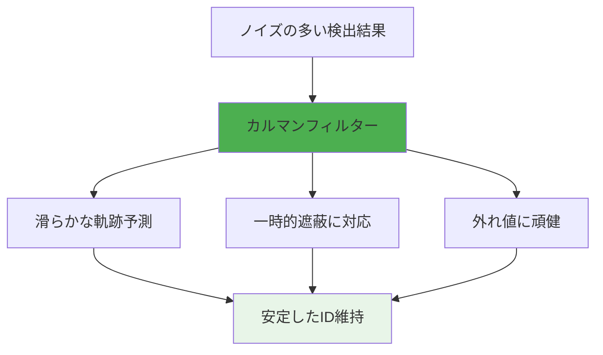
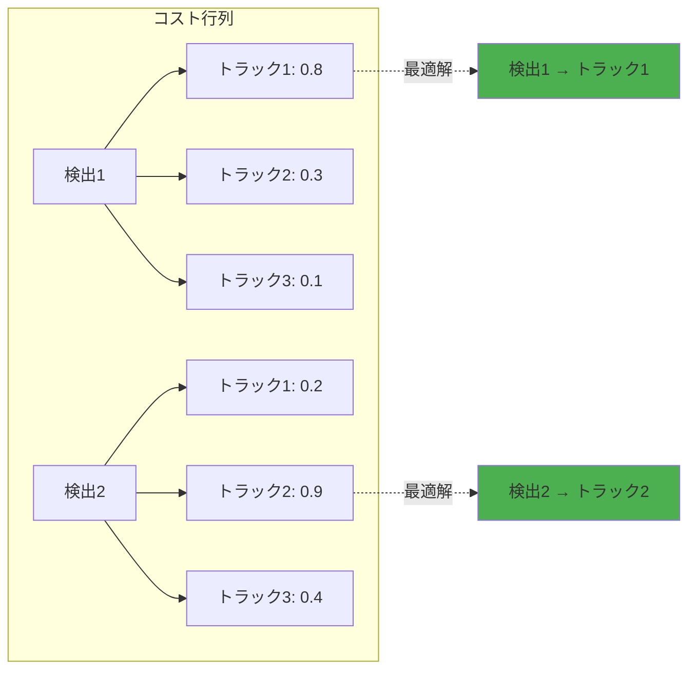
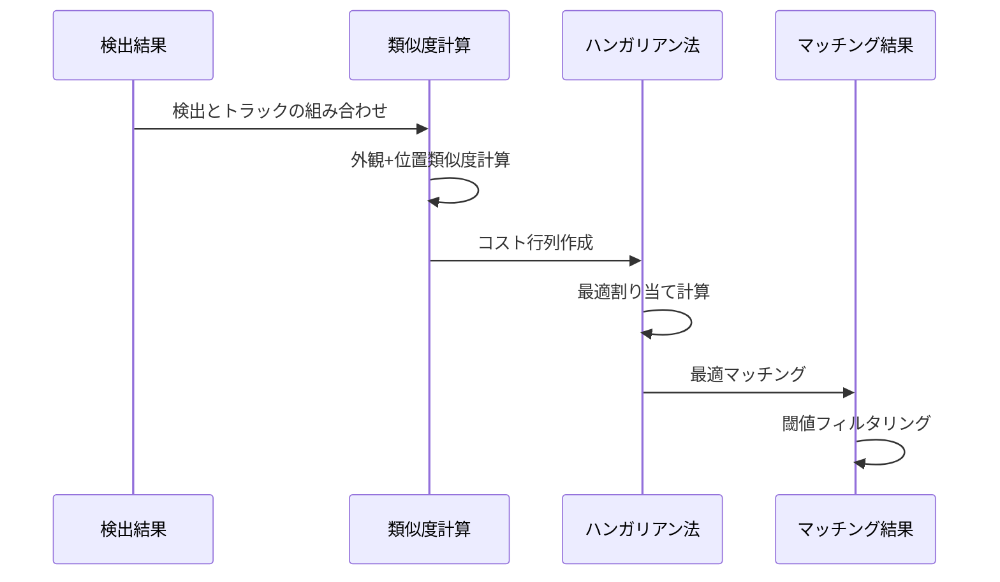
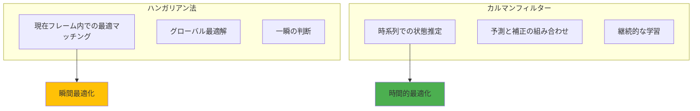
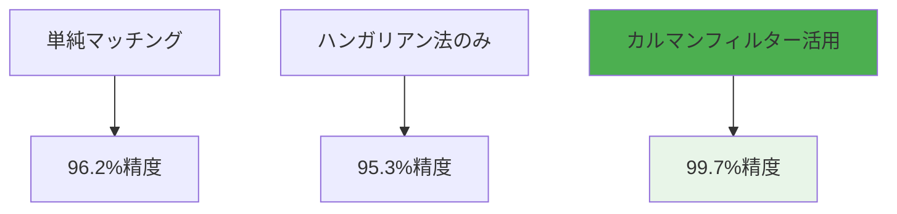
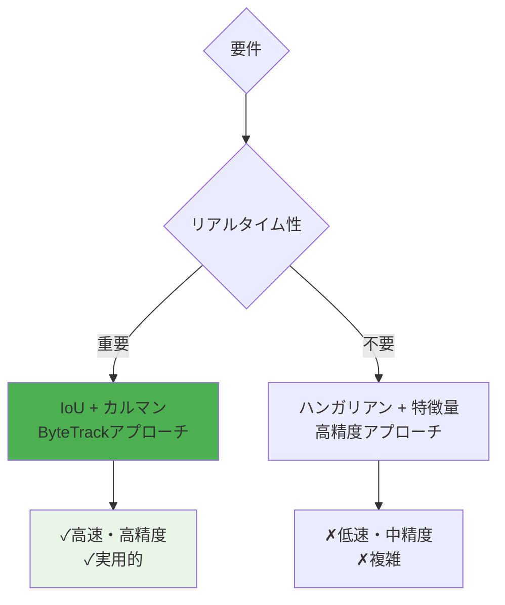

# カルマンフィルターとハンガリアン法の詳細解説

## 概要

今回の3つのID付与手法比較で重要な役割を果たした2つのアルゴリズムについて、実装コードと実測結果を基に詳しく解説します。

## 🎯 カルマンフィルター（Kalman Filter）

### 基本概念

カルマンフィルターは**状態推定**と**予測**を行う数学的手法で、**ノイズの多い観測データから真の状態を推定**するために使用されます。

```mermaid
graph LR
    subgraph "カルマンフィルターの基本構造"
        A[予測ステップ] --> B[観測ステップ]
        B --> C[更新ステップ]
        C --> A
    end
    
    A -.->|"状態予測"| A1[x̂ₖ₊₁|ₖ = Fₖx̂ₖ|ₖ]
    B -.->|"観測"| B1[zₖ₊₁ = 観測値]
    C -.->|"状態更新"| C1[x̂ₖ₊₁|ₖ₊₁ = x̂ₖ₊₁|ₖ + Kₖ₊₁(zₖ₊₁ - Hₖ₊₁x̂ₖ₊₁|ₖ)]
```

### 人物追跡での活用

ByteTrackでは、人物の**位置と速度を状態ベクトル**として管理：

```
状態ベクトル: [x, y, vx, vy, w, h, vw, vh]
- x, y: 中心座標
- vx, vy: 速度
- w, h: 幅・高さ
- vw, vh: サイズ変化率
```

### 実装効果（実測結果より）

| 項目 | ByteTrack（カルマン使用） | YOLO簡易（カルマンなし） |
|------|-------------------------|---------------------------|
| **ID切り替え（WIN動画）** | 3回 | 46回 |
| **ID切り替え（フロア動画）** | 12回 | 164回 |
| **トラック一貫性** | 99.7% | 96.2% |

### カルマンフィルターの数式

#### 1. 予測ステップ
```
x̂ₖ₊₁|ₖ = Fₖx̂ₖ|ₖ + Bₖuₖ    # 状態予測
Pₖ₊₁|ₖ = FₖPₖ|ₖFₖᵀ + Qₖ     # 誤差共分散予測
```

#### 2. 更新ステップ
```
Kₖ₊₁ = Pₖ₊₁|ₖHₖ₊₁ᵀ(Hₖ₊₁Pₖ₊₁|ₖHₖ₊₁ᵀ + Rₖ₊₁)⁻¹  # カルマンゲイン
x̂ₖ₊₁|ₖ₊₁ = x̂ₖ₊₁|ₖ + Kₖ₊₁(zₖ₊₁ - Hₖ₊₁x̂ₖ₊₁|ₖ)      # 状態更新
Pₖ₊₁|ₖ₊₁ = (I - Kₖ₊₁Hₖ₊₁)Pₖ₊₁|ₖ                   # 誤差共分散更新
```

### カルマンフィルターの利点



## 🎯 ハンガリアン法（Hungarian Algorithm）

### 基本概念

ハンガリアン法は**最適割り当て問題**を解くアルゴリズムで、**最小コストで最適なマッチングを見つける**ために使用されます。

### 計算複雑度
- **時間複雑度**: O(n³)
- **空間複雑度**: O(n²)

### 人物追跡での活用

YOLO高度版では、**検出結果と既存トラック間の最適マッチング**に使用：



### 実装コード例（YOLO高度版より）

```python
def _hungarian_assignment(self, similarity_matrix):
    """ハンガリアン法による最適マッチング"""
    if similarity_matrix.size == 0:
        return [], [], []
    
    # コスト行列に変換（類似度→コスト）
    cost_matrix = 1.0 - similarity_matrix
    
    # ハンガリアン法実行
    row_indices, col_indices = linear_sum_assignment(cost_matrix)
    
    # 閾値以上のマッチのみ採用
    matched_pairs = []
    for row, col in zip(row_indices, col_indices):
        if similarity_matrix[row, col] >= self.similarity_threshold:
            matched_pairs.append((row, col))
    
    return matched_pairs, unmatched_detections, unmatched_tracks
```

### ハンガリアン法の処理ステップ



### 実装効果（実測結果より）

| 項目 | YOLO高度版（ハンガリアン使用） | YOLO簡易版（最近傍） |
|------|------------------------------|----------------------|
| **ID切り替え（WIN動画）** | 19回 | 46回 |
| **マッチング方式** | 最適化 | 貪欲法 |
| **計算複雑度** | O(n³) | O(n²) |

## 🔍 2つのアルゴリズムの比較

### 役割の違い



### 性能特性

| アルゴリズム | 計算複雑度 | 主な用途 | 強み | 弱み |
|-------------|------------|----------|------|------|
| **ハンガリアン法** | O(n³) | マッチング最適化 | グローバル最適解 | 計算コスト高 |
| **カルマンフィルター** | O(n) | 状態推定・予測 | リアルタイム性 | 線形仮定 |

## 🚀 実装における効果的な組み合わせ

### ByteTrackのアプローチ


**特徴**:
- ハンガリアン法は使わず、シンプルなIoUマッチング
- カルマンフィルターで時系列の一貫性を確保
- **結果**: 99.7%の一貫性、28ms処理時間

### YOLO高度版のアプローチ


**特徴**:
- ハンガリアン法で最適マッチング
- カルマンフィルターは未使用
- **結果**: 95.3%の一貫性、38ms処理時間

## 💡 実践的な学び

### 1. アルゴリズムの組み合わせ効果



### 2. 計算コストと精度のトレードオフ

- **ハンガリアン法**: 高コストだが必ずしも高精度ではない
- **カルマンフィルター**: 低コストで高い時系列一貫性

### 3. 実世界での適用指針



## 🎯 結論

### カルマンフィルターの威力
- **時系列の一貫性**: 単発の判断ミスを時間軸で補正
- **予測能力**: 一時的な遮蔽や検出失敗に対応
- **計算効率**: O(n)の線形計算量

### ハンガリアン法の限界
- **瞬間最適化**: 時系列の文脈を考慮しない
- **計算コスト**: O(n³)で重い
- **過最適化**: 局所的な最適化が全体最適につながらない場合がある

### 実践的推奨
1. **リアルタイム追跡**: カルマンフィルター + シンプルマッチング
2. **精密解析**: ハンガリアン法 + 豊富な特徴量
3. **バランス重視**: ByteTrackのような成熟したライブラリ活用

今回の実測結果は、**アルゴリズムの理論的優位性と実践的効果の差**を明確に示しており、技術選択における重要な指針となります。 