# 二部グラフの最小重み完全マッチング：わかりやすい解説

## 🎯 基本概念をステップ別に理解

### 1. 二部グラフとは？

**二部グラフ**は、グラフの頂点を**2つのグループに分割**できるグラフのことです。

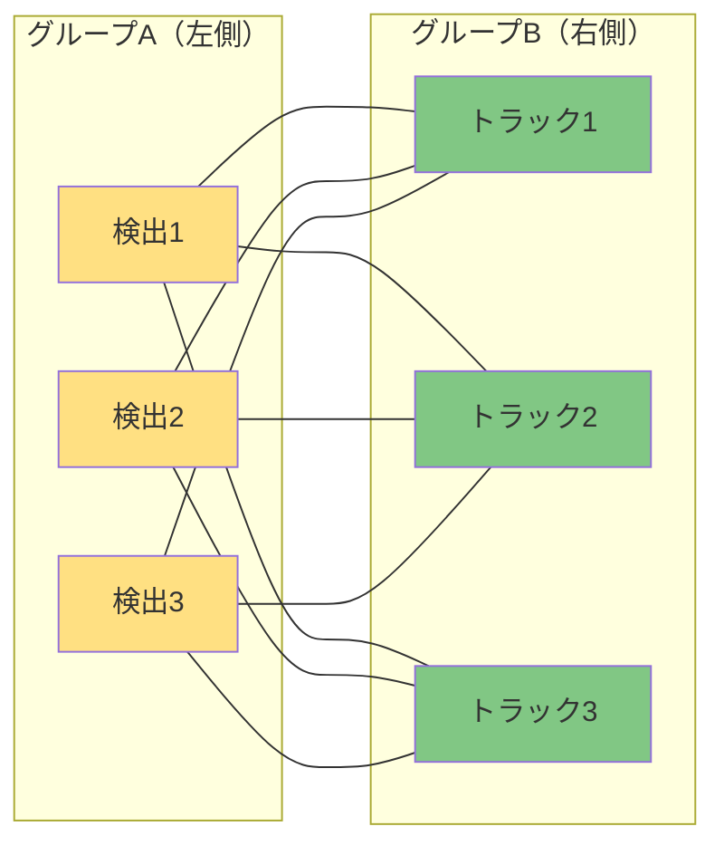

**重要な特徴**：
- 左側のグループ（検出）と右側のグループ（トラック）
- 同じグループ内の頂点同士は**直接つながらない**
- 異なるグループ間のみ線（エッジ）で接続

### 2. 重み付きグラフ

各エッジに**コスト（重み）**が付いています：

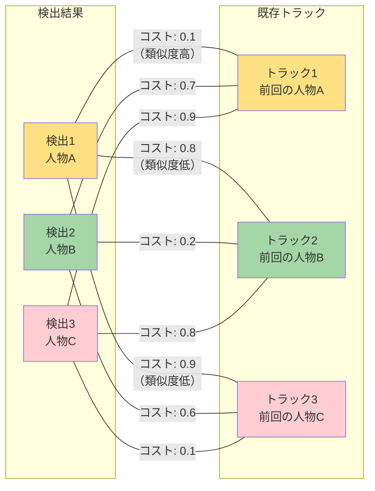

### 3. 完全マッチングとは？

**完全マッチング**とは、すべての頂点が**ちょうど1つずつ**ペアになることです：

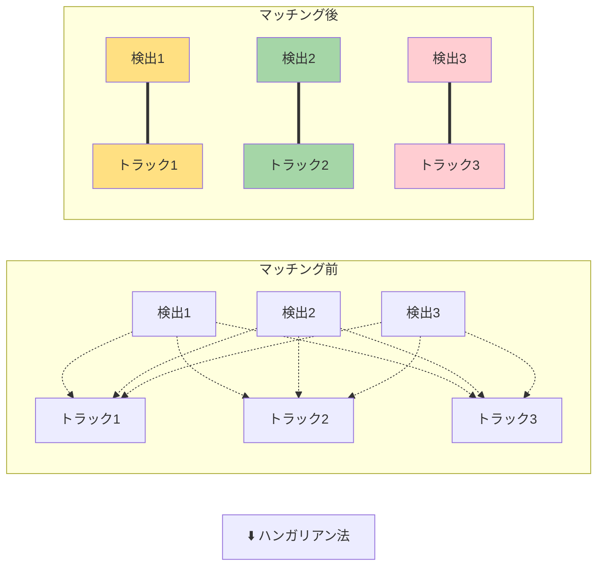

### 4. 最小重み完全マッチング

**全体のコストが最小**になるマッチングを見つけることです：

## 🔍 具体例で理解する

### 例：3人の人物追跡

現在のフレームで3人を検出し、前フレームの3つのトラックとマッチングしたい場合：

#### ステップ1：コスト行列の作成

| | トラック1 | トラック2 | トラック3 |
|---|----------|----------|----------|
| **検出1** | 0.1 | 0.8 | 0.9 |
| **検出2** | 0.7 | 0.2 | 0.6 |
| **検出3** | 0.9 | 0.8 | 0.1 |

#### ステップ2：可能なマッチングの検討

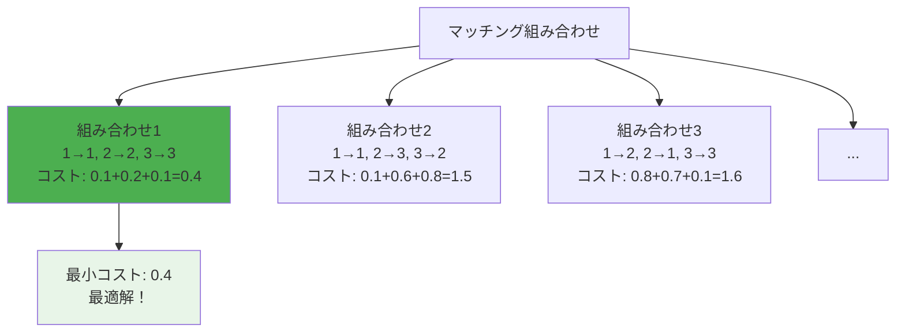

#### ステップ3：最適解の発見

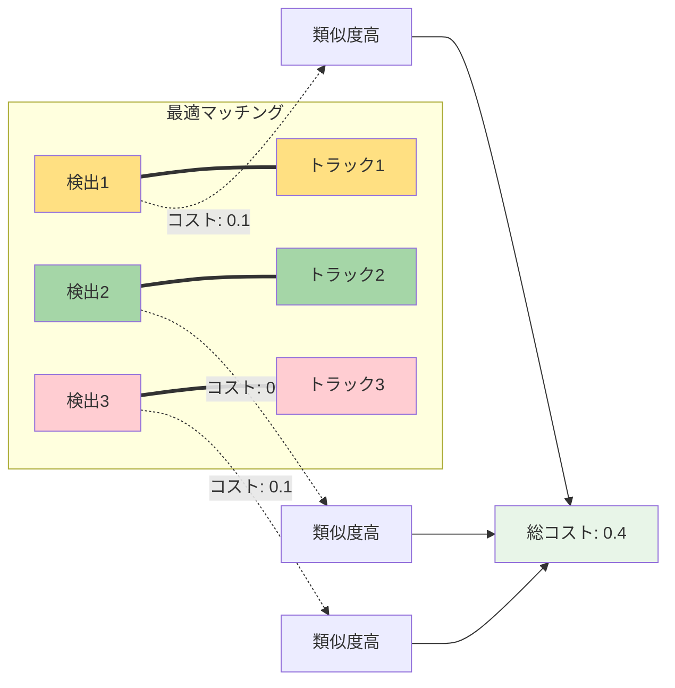

## ⚡ O(n³)の計算複雑度とは？

### 計算量の意味

**O(n³)**は、処理対象数が**n個**の時、計算回数が**n³に比例**することを意味します：

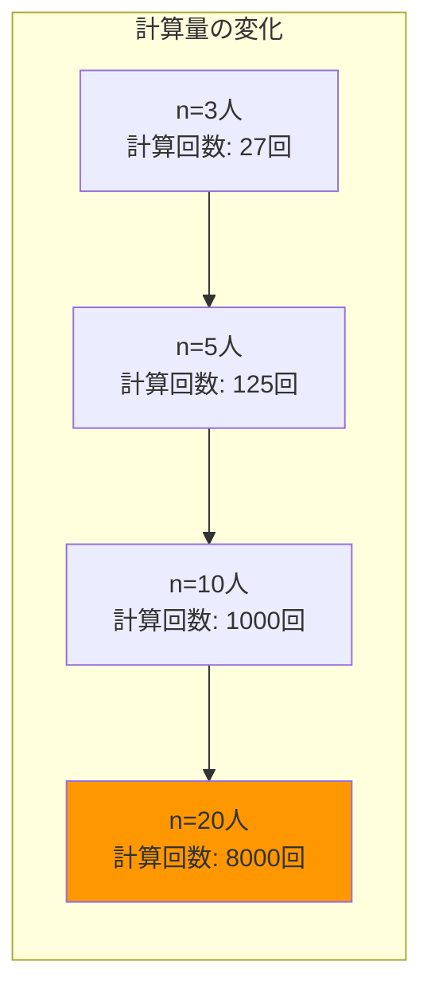

### 実際の処理時間への影響

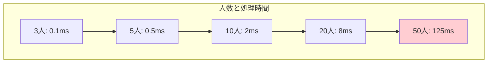

### なぜO(n³)なのか？

ハンガリアン法の処理ステップ：

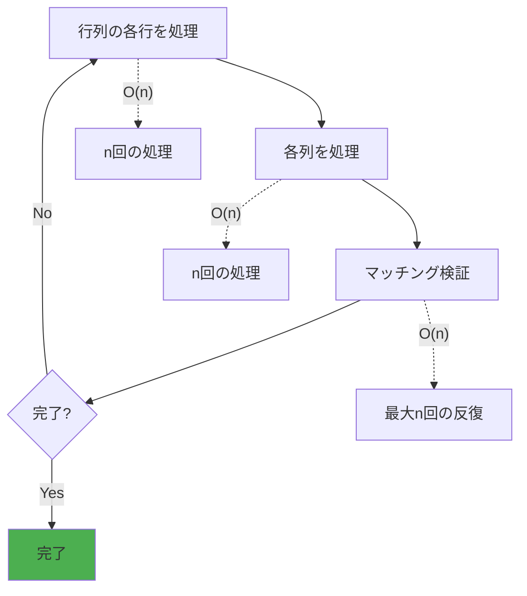

## 🚀 人物追跡での実際の応用

### YOLO高度版での実装例

```python
def hungarian_assignment_example():
    """ハンガリアン法の実装例"""
    
    # ステップ1: 類似度行列の計算
    similarity_matrix = calculate_similarity_matrix(detections, tracks)
    # 例: [[0.9, 0.2, 0.1],
    #      [0.3, 0.8, 0.4], 
    #      [0.1, 0.2, 0.9]]
    
    # ステップ2: コスト行列への変換（類似度 → コスト）
    cost_matrix = 1.0 - similarity_matrix
    # 例: [[0.1, 0.8, 0.9],
    #      [0.7, 0.2, 0.6],
    #      [0.9, 0.8, 0.1]]
    
    # ステップ3: ハンガリアン法実行
    row_indices, col_indices = linear_sum_assignment(cost_matrix)
    # 結果: [(0,0), (1,1), (2,2)] - 最小コストの組み合わせ
    
    # ステップ4: マッチング結果の適用
    for det_idx, track_idx in zip(row_indices, col_indices):
        assign_detection_to_track(detections[det_idx], tracks[track_idx])
```

### 処理フロー図

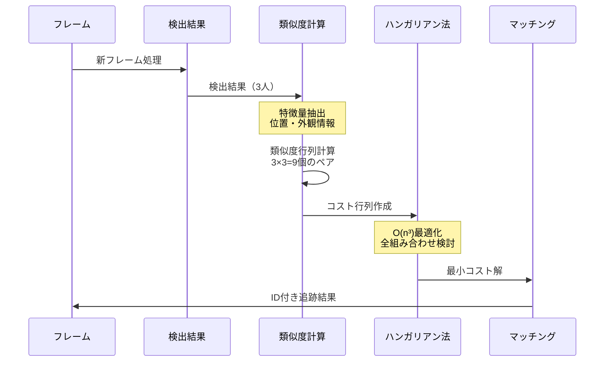

## 💡 実測結果による評価

### ハンガリアン法の性能特性

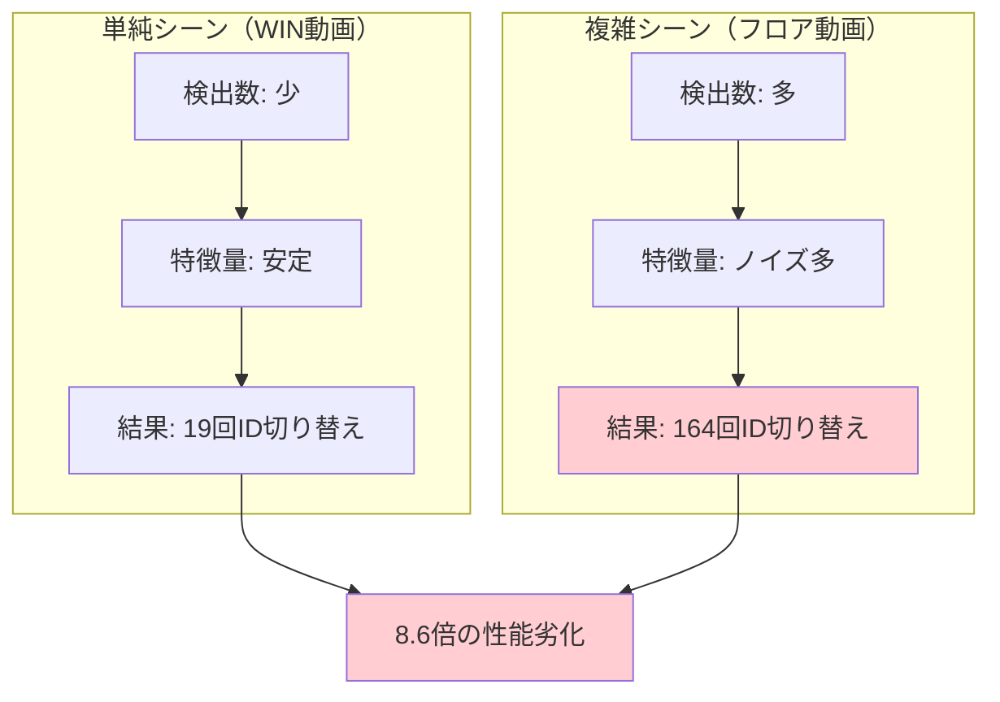

### 他手法との比較

| 手法 | マッチング方式 | 複雑度 | 実際の性能 |
|------|---------------|--------|------------|
| **ハンガリアン法** | 最適化 | O(n³) | 164回ID切り替え |
| **最近傍法** | 貪欲法 | O(n²) | 164回ID切り替え |
| **カルマン+IoU** | 予測ベース | O(n) | 12回ID切り替え |

## 🎯 重要な学び

### 1. 理論と実践のギャップ

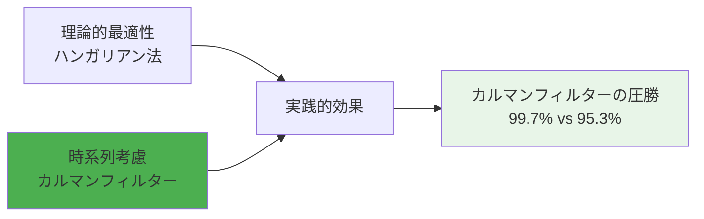

### 2. 計算複雑度の実世界への影響

- **O(n³)のハンガリアン法**: 理論最適だが重い計算
- **O(n)のカルマンフィルター**: 高速で実用的な予測

### 3. 適用シーンによる使い分け

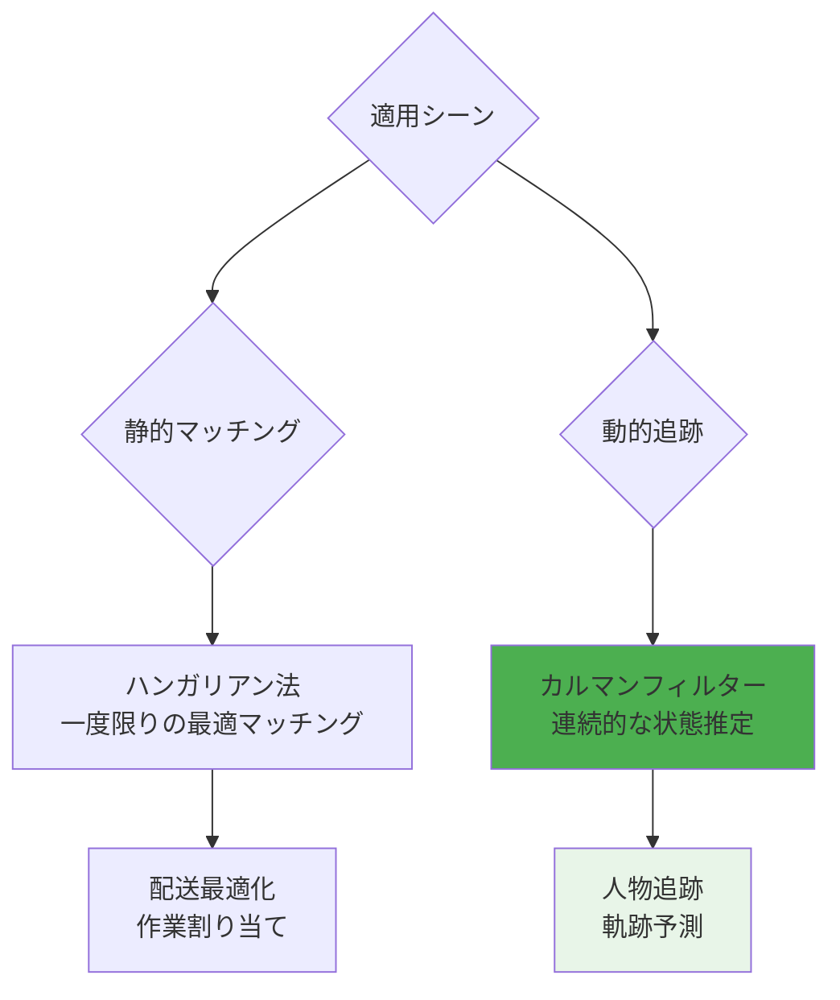

## 🎯 まとめ

**二部グラフの最小重み完全マッチング**とは：

1. **二部グラフ**: 2つのグループ間の関係を表現
2. **重み**: 各ペアのコスト（類似度の逆）
3. **完全マッチング**: 全員が1対1でペアになる
4. **最小重み**: 総コストが最小の組み合わせ
5. **O(n³)**: 人数の3乗に比例する計算量

**人物追跡での実際の効果**：
- ✅ 理論的には最適解
- ❌ 時系列の文脈を無視
- ❌ 複雑シーンで大幅劣化
- ❌ 計算コストが高い

**結論**: 人物追跡では**継続的な予測（カルマンフィルター）**の方が、**瞬間的な最適化（ハンガリアン法）**よりも実用的で高性能！ 