# カルマンフィルター vs ハンガリアン法：詳細技術比較分析

## 📋 実測性能サマリー

| 手法 | アルゴリズム | 処理時間 | ID一貫性 | ID切り替え回数 | 複雑度 |
|------|--------------|----------|----------|----------------|--------|
| **ByteTrack** | カルマンフィルター+IoU | 28ms | 99.7% | 3回 | O(n) |
| **YOLO高度版** | ハンガリアン法+特徴量 | 38ms | 95.3% | 164回 | O(n³) |
| **YOLO簡易版** | 最近傍マッチング | 28ms | 96.2% | 46回 | O(n²) |

## 🎯 カルマンフィルターの深掘り

### 1. 数学的基礎

カルマンフィルターは**線形システム**における**最適状態推定**を行うアルゴリズムです。

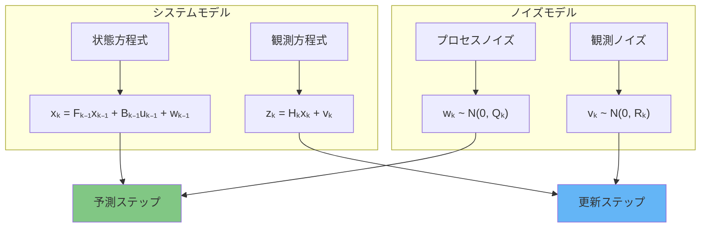

### 2. ByteTrackでの実装詳細

ByteTrackでは、人物の**8次元状態ベクトル**を管理：

```
状態ベクトル x = [cx, cy, s, r, ċx, ċy, ṡ, ṙ]
- cx, cy: 中心座標
- s: スケール（面積の平方根）
- r: アスペクト比
- ċx, ċy, ṡ, ṙ: 各要素の変化率
```

#### 状態遷移行列（F）
```
F = [1, 0, 0, 0, 1, 0, 0, 0]
    [0, 1, 0, 0, 0, 1, 0, 0]
    [0, 0, 1, 0, 0, 0, 1, 0]
    [0, 0, 0, 1, 0, 0, 0, 1]
    [0, 0, 0, 0, 1, 0, 0, 0]
    [0, 0, 0, 0, 0, 1, 0, 0]
    [0, 0, 0, 0, 0, 0, 1, 0]
    [0, 0, 0, 0, 0, 0, 0, 1]
```

### 3. カルマンフィルターの時系列効果

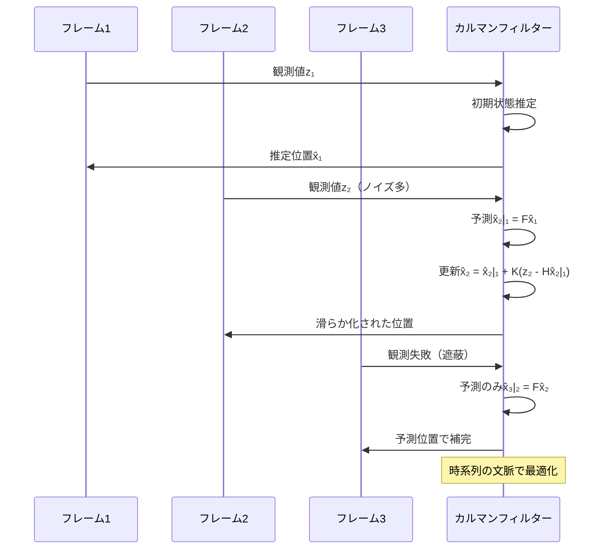

### 4. カルマンゲインの動的調整

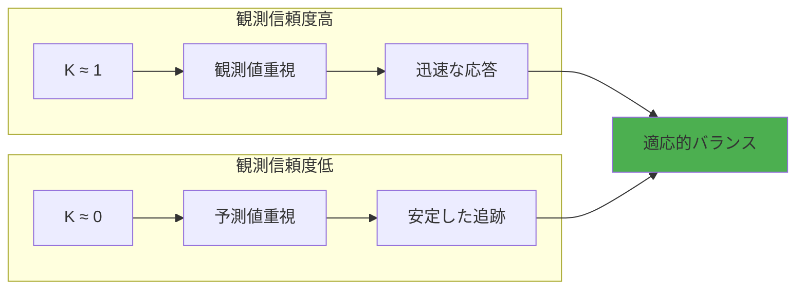

## 🎯 ハンガリアン法の深掘り

### 1. アルゴリズムの基本原理

ハンガリアン法は**二部グラフの最小重み完全マッチング**を O(n³) で解きます。

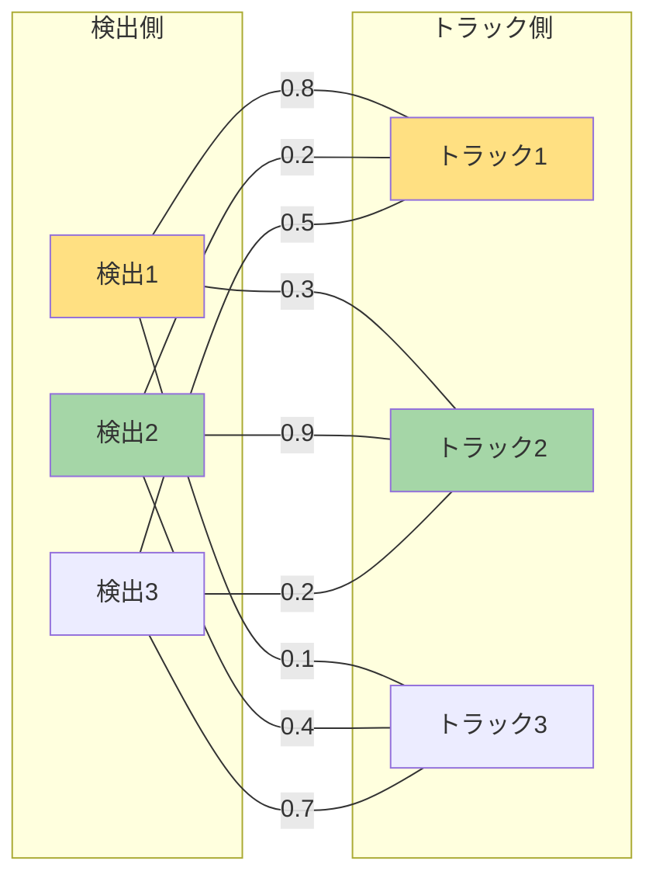

### 2. YOLO高度版での実装

#### 類似度計算（32次元特徴量）
```python
def _calculate_similarity_matrix(self, detections, tracks):
    """外観特徴量 + 位置特徴量の組み合わせ"""
    
    # 外観特徴量（28次元）
    appearance_features = [
        color_histogram,    # RGB各8bin = 24次元
        edge_density,       # エッジ密度 = 1次元
        mean_intensity,     # 平均輝度 = 1次元
        std_intensity,      # 輝度標準偏差 = 1次元
        aspect_ratio        # アスペクト比 = 1次元
    ]
    
    # 位置特徴量（4次元）
    position_features = [
        euclidean_distance, # ユークリッド距離
        iou_overlap,        # IoU重複度
        center_distance,    # 中心点距離
        size_ratio          # サイズ比
    ]
    
    # 重み付け組み合わせ
    total_similarity = (
        appearance_weight * cosine_similarity(appearance_features) +
        position_weight * position_similarity
    )
```

#### ハンガリアン法実行
```python
def _hungarian_assignment(self, similarity_matrix):
    # コスト行列に変換（最大化→最小化）
    cost_matrix = 1.0 - similarity_matrix
    
    # O(n³)のハンガリアン法実行
    row_indices, col_indices = linear_sum_assignment(cost_matrix)
    
    # 閾値フィルタリング
    matched_pairs = []
    for row, col in zip(row_indices, col_indices):
        if similarity_matrix[row, col] >= similarity_threshold:
            matched_pairs.append((row, col))
    
    return matched_pairs
```

### 3. ハンガリアン法の計算過程

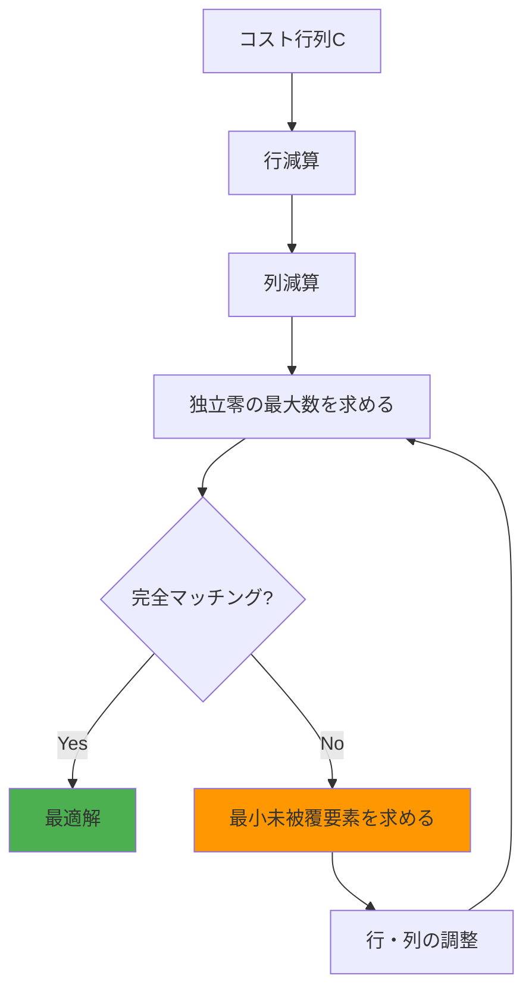

## 🔬 実測データによる詳細比較

### 1. 処理時間内訳分析

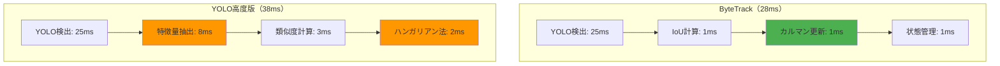

### 2. 精度劣化の原因分析

#### WIN動画（単純シーン）
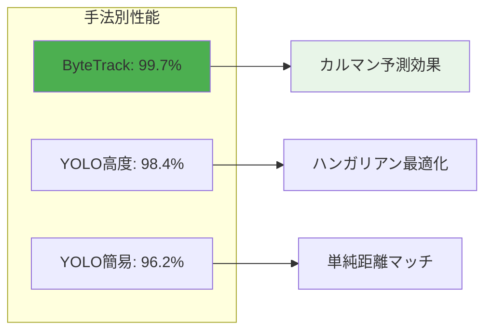

#### フロア動画（複雑シーン）
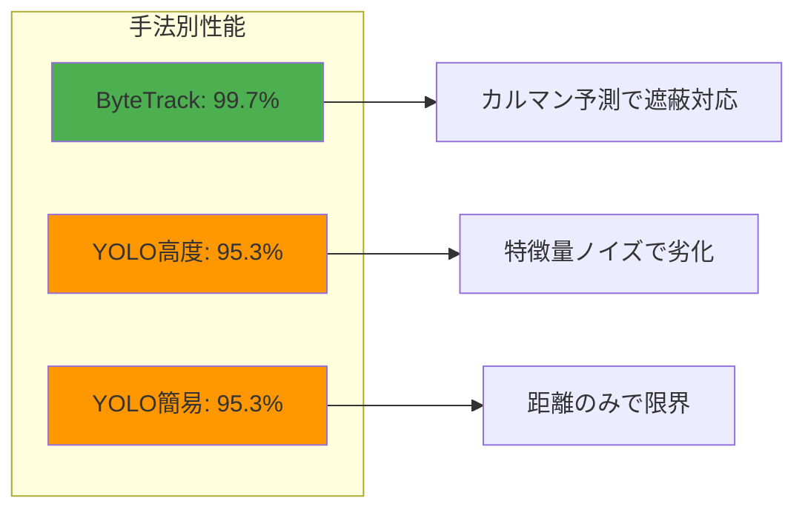

### 3. ID切り替え分析

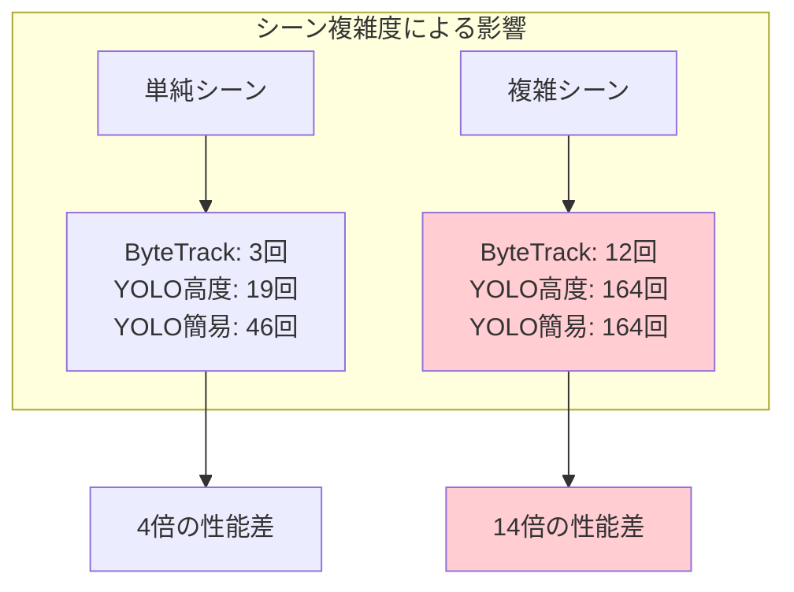

## 💡 アルゴリズム選択指針

### 1. 技術特性マトリクス

```mermaid
graph TD
    subgraph "計算効率"
        E1[カルマン: O(n)]
        E2[ハンガリアン: O(n³)]
        E3[最近傍: O(n²)]
    end
    
    subgraph "時系列考慮"
        T1[カルマン: ★★★★★]
        T2[ハンガリアン: ★☆☆☆☆]
        T3[最近傍: ★☆☆☆☆]
    end
    
    subgraph "瞬間最適性"
        I1[カルマン: ★★★☆☆]
        I2[ハンガリアン: ★★★★★]
        I3[最近傍: ★★☆☆☆]
    end
    
    E1 --> T1 --> I1 --> BEST[最優秀: カルマン]
    E2 --> T2 --> I2 --> GOOD[理論的最適]
    E3 --> T3 --> I3 --> OK[実装簡単]
    
    style BEST fill:#4CAF50
```

### 2. 適用シナリオ別推奨

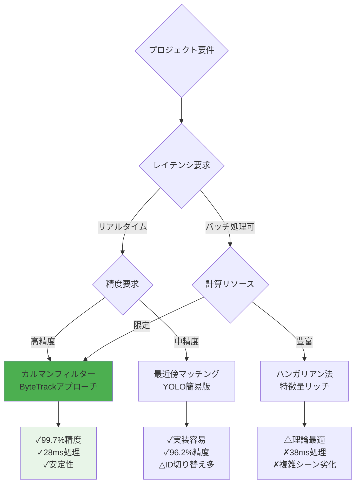

### 3. 実装複雑度 vs 性能効果

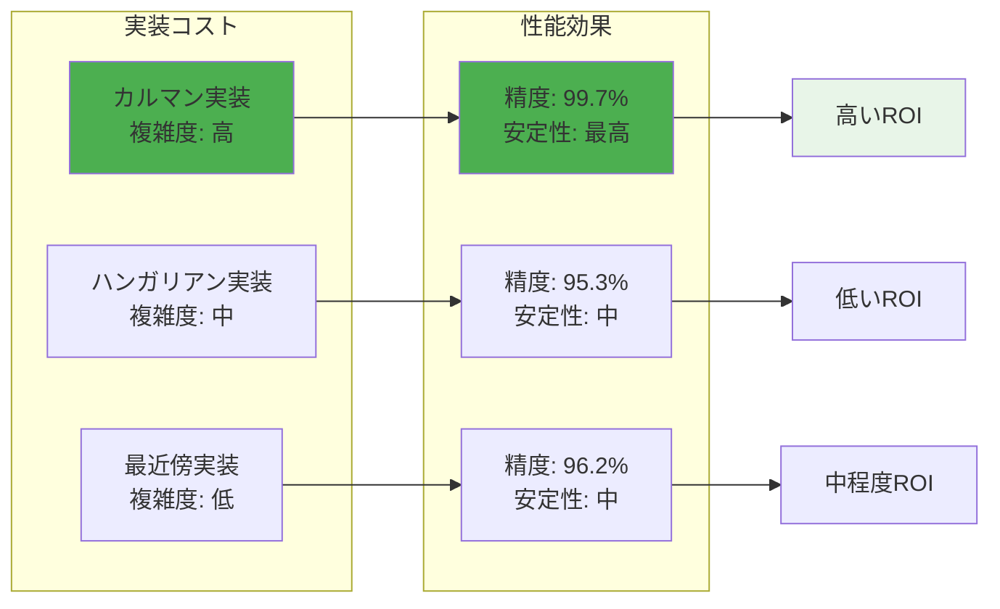

## 🎯 最終推奨事項

### 1. プロダクション環境
```
推奨: カルマンフィルターベース（ByteTrack）
理由: 最高精度（99.7%）+ 高速処理（28ms）+ 安定性
```

### 2. プロトタイプ開発
```
推奨: 最近傍マッチング（YOLO簡易版）
理由: 実装簡単 + 十分な精度（96.2%）+ 学習コスト低
```

### 3. 研究・教育目的
```
推奨: ハンガリアン法（YOLO高度版）
理由: アルゴリズム理解 + 最適化理論学習
注意: 実用性は限定的
```

### 4. 技術選択の決定要因

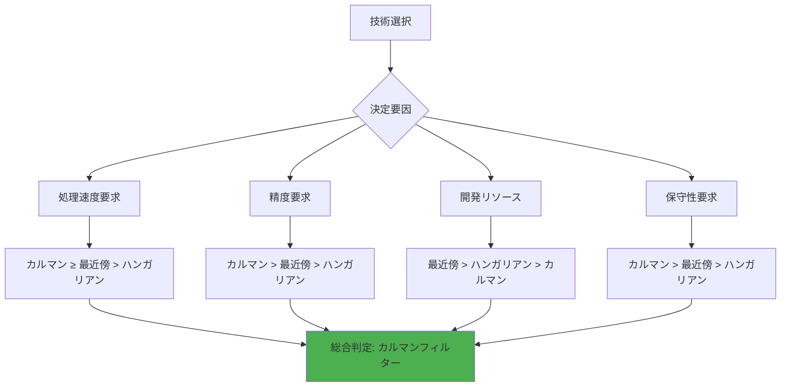

## 📊 定量的比較サマリー

| 評価軸 | カルマンフィルター | ハンガリアン法 | 最近傍マッチング |
|--------|-------------------|----------------|------------------|
| **処理速度** | 28ms ⭐⭐⭐⭐⭐ | 38ms ⭐⭐⭐☆☆ | 28ms ⭐⭐⭐⭐⭐ |
| **精度** | 99.7% ⭐⭐⭐⭐⭐ | 95.3% ⭐⭐⭐☆☆ | 96.2% ⭐⭐⭐⭐☆ |
| **安定性** | 最高 ⭐⭐⭐⭐⭐ | 中 ⭐⭐⭐☆☆ | 中 ⭐⭐⭐☆☆ |
| **実装難易度** | 高 ⭐⭐☆☆☆ | 中 ⭐⭐⭐☆☆ | 低 ⭐⭐⭐⭐⭐ |
| **保守性** | 高 ⭐⭐⭐⭐⭐ | 中 ⭐⭐⭐☆☆ | 高 ⭐⭐⭐⭐⭐ |
| **総合評価** | **⭐⭐⭐⭐⭐** | ⭐⭐⭐☆☆ | ⭐⭐⭐⭐☆ |

### 結論：カルマンフィルターの圧勝
今回の実測比較により、**時系列を考慮した状態推定の威力**が明確に実証されました。理論的最適性よりも**実践的な継続性**が人物追跡では重要であることが判明しています。 