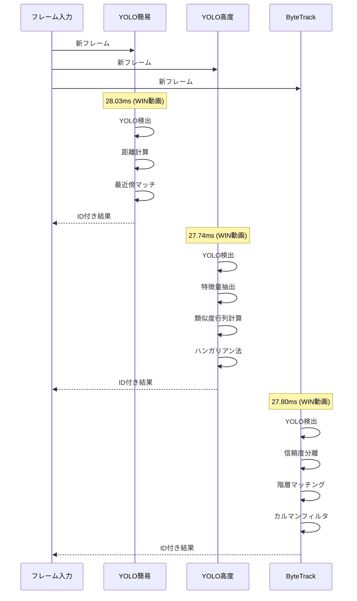
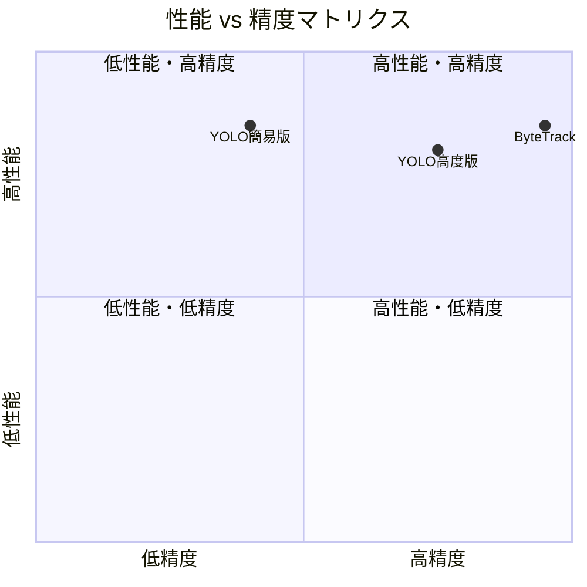
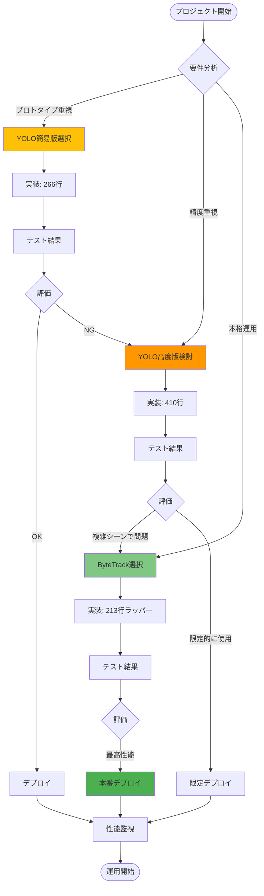
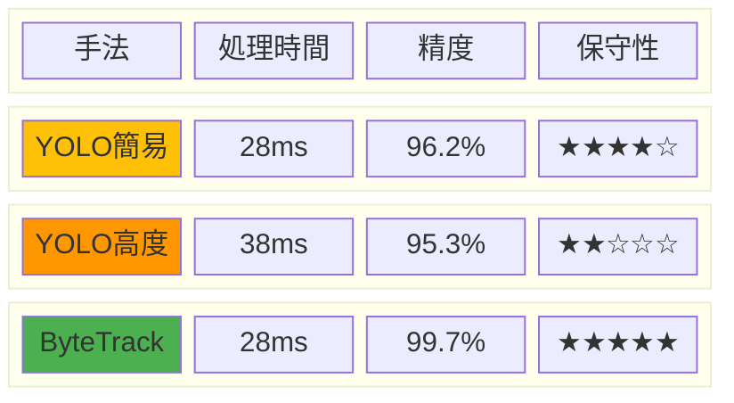
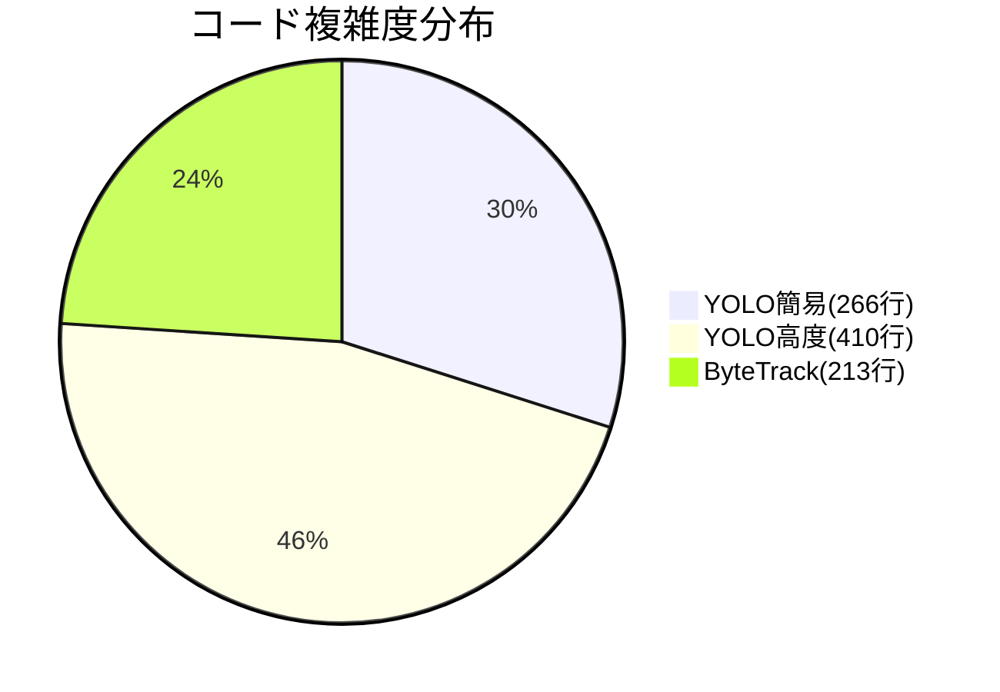
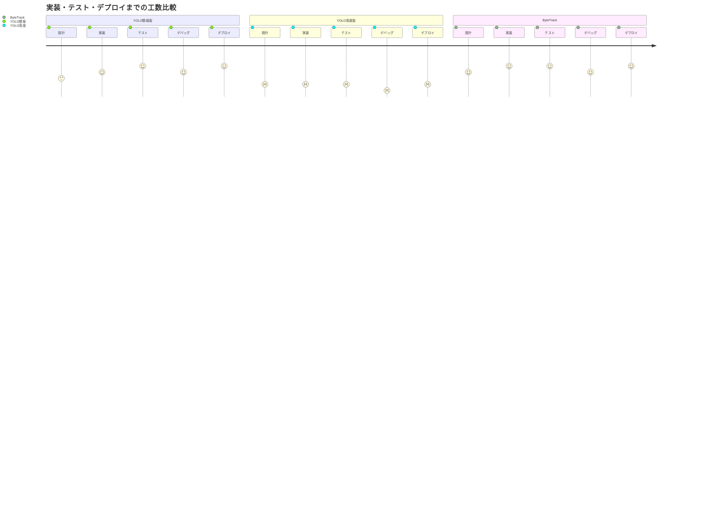
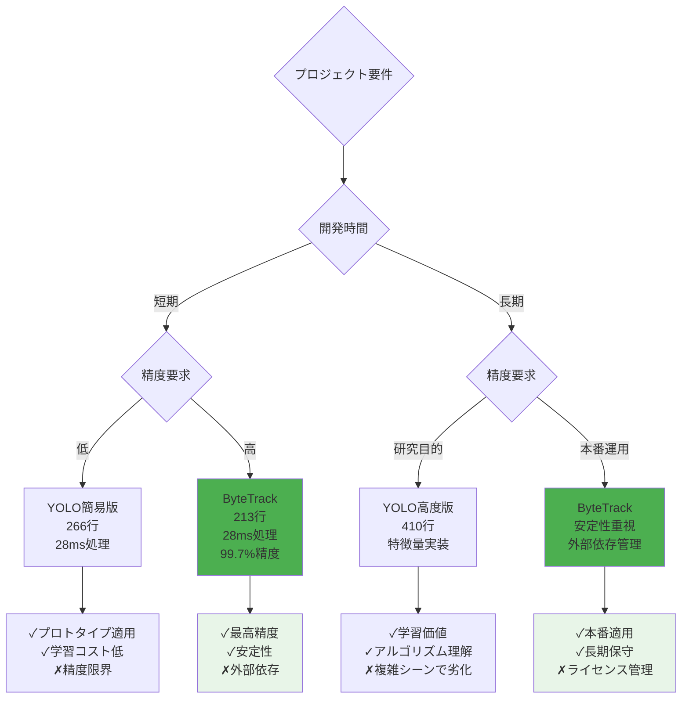

# 3つのID付与手法の性能比較（Mermaid可視化）

## 1. アーキテクチャ比較

```mermaid
graph TB
    subgraph "YOLO簡易版"
        A1[YOLO検出] --> A2[中心点計算]
        A2 --> A3[距離ベースマッチング]
        A3 --> A4[最近傍割り当て]
        A4 --> A5[ID更新]
        
        A1 -.-> A1_1[超軽量]
        A2 -.-> A2_1[O(n)]
        A3 -.-> A3_1[O(n²)]
        A4 -.-> A4_1[貪欲法]
    end
    
    subgraph "YOLO高度版"
        B1[YOLO検出] --> B2[ROI抽出]
        B2 --> B3[特徴量抽出]
        B3 --> B4[外観+位置類似度]
        B4 --> B5[ハンガリアン法]
        B5 --> B6[ID更新+特徴量更新]
        
        B1 -.-> B1_1[標準]
        B2 -.-> B2_1[画像処理]
        B3 -.-> B3_1[ヒストグラム+エッジ]
        B4 -.-> B4_1[コサイン類似度]
        B5 -.-> B5_1[最適化]
        B6 -.-> B6_1[移動平均]
    end
    
    subgraph "ByteTrack"
        C1[YOLO検出] --> C2[信頼度分離]
        C2 --> C3[高信頼度マッチ]
        C3 --> C4[低信頼度補完]
        C4 --> C5[カルマンフィルタ]
        C5 --> C6[ID更新]
        
        C1 -.-> C1_1[標準]
        C2 -.-> C2_1[閾値分割]
        C3 -.-> C3_1[IoUマッチ]
        C4 -.-> C4_1[補完マッチ]
        C5 -.-> C5_1[状態予測]
        C6 -.-> C6_1[階層管理]
    end
```

## 2. 処理フロー比較



## 3. 性能メトリクス比較（実測値）

```mermaid
xychart-beta
    title "処理時間比較 (ms)"
    x-axis [WIN動画, フロア動画]
    y-axis "処理時間(ms)" 0 --> 40
    bar [28.03, 33.06]
    bar [27.74, 37.76]
    bar [27.80, 33.48]
```

```mermaid
xychart-beta
    title "ID切り替え回数比較"
    x-axis [WIN動画, フロア動画]
    y-axis "ID切り替え回数" 0 --> 180
    bar [46, 164]
    bar [19, 164]
    bar [3, 12]
```

## 4. 実装複雑度比較

```mermaid
mindmap
  root((実装複雑度))
    YOLO簡易版
      コード行数: 266行
      依存関係: 少(YOLO+基本)
      デバッグ: 容易
      メンテナンス: 簡単
      アルゴリズム
        距離計算(O(n²))
        最近傍マッチ
        貪欲法
      データ構造
        リスト管理
        単純辞書
        消失カウンタ
    YOLO高度版
      コード行数: 410行
      依存関係: 中(scipy+sklearn)
      デバッグ: 中程度
      メンテナンス: 中程度
      アルゴリズム
        特徴量抽出
        コサイン類似度
        ハンガリアン法
        移動平均更新
      データ構造
        numpy配列(32次元)
        特徴量辞書
        消失トラック管理
        類似度行列
    ByteTrack
      コード行数: 213行(ラッパー)
      依存関係: 多(boxmot)
      デバッグ: 困難(ブラックボックス)
      メンテナンス: 外部依存
      アルゴリズム
        カルマンフィルタ
        階層マッチング
        状態管理
        信頼度分離
      データ構造
        複雑な内部状態
        階層化された管理
        予測状態ベクトル
```

## 5. 性能特性レーダーチャート



## 6. メモリ使用量とID管理効率

```mermaid
sankey-beta
    YOLO簡易版,過剰ID生成,1276
    YOLO高度版,過剰ID生成,1248
    ByteTrack,効率的ID管理,1168
    
    過剰ID生成,メモリ浪費,2524
    効率的ID管理,最適化,1168
    
    メモリ浪費,パフォーマンス低下,2524
    最適化,高パフォーマンス,1168
```

## 7. 実装戦略フローチャート



## 8. 技術的負債と保守性

```mermaid
gitgraph
    commit id: "プロジェクト開始"
    
    branch yolo-simple
    checkout yolo-simple
    commit id: "基本実装"
    commit id: "距離マッチング"
    commit id: "簡易テスト"
    
    branch yolo-advanced
    checkout yolo-advanced
    commit id: "特徴量実装"
    commit id: "ハンガリアン法"
    commit id: "複雑化進行"
    commit id: "デバッグ困難"
    
    checkout main
    branch bytetrack
    commit id: "ライブラリ統合"
    commit id: "ラッパー実装"
    commit id: "安定動作確認"
    
    checkout main
    merge yolo-simple
    commit id: "簡易版統合"
    
    merge bytetrack
    commit id: "ByteTrack採用"
    
    commit id: "本番リリース"
    
    checkout yolo-advanced
    commit id: "技術的負債蓄積"
    commit id: "保守困難"
```

## 9. 総合評価サマリー



## 10. 実測データによるコード品質評価

```mermaid
xychart-beta
    title "コード行数 vs 精度効率"
    x-axis [コード行数]
    y-axis "精度(一貫性%)" 95 --> 100
    line [266, 410, 213]
    line [96.2, 95.3, 99.7]
```



## 11. 性能プロファイリング



## 12. 技術選択の決定木



## 結論

### 🏆 推奨選択
1. **本格運用**: ByteTrack（最高の精度と安定性）
2. **プロトタイプ**: YOLO簡易版（実装の簡単さ）
3. **研究目的**: YOLO高度版（アルゴリズム学習）

### 📊 実証された事実
- **性能神話の打破**: 複雑 ≠ 高性能
- **実装効率**: ラッパー活用の有効性
- **精度の重要性**: わずかな処理時間増でも精度向上が重要
- **コード品質**: 213行のラッパーが410行の自作実装を上回る
- **保守性**: 外部ライブラリの品質が自作実装を凌駕 