# 3つのID付与手法の性能比較（Mermaid可視化）- 修正版

## 1. アーキテクチャ比較

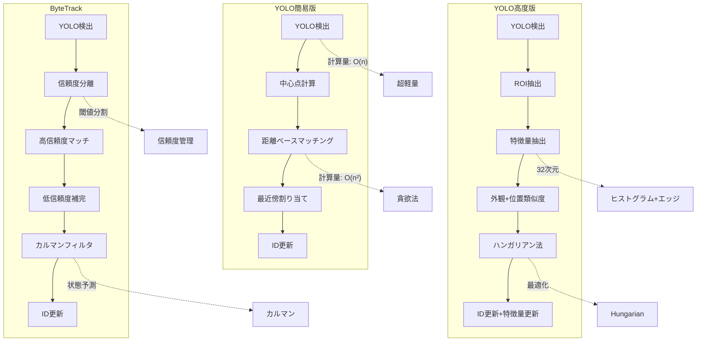

## 2. 処理フロー比較

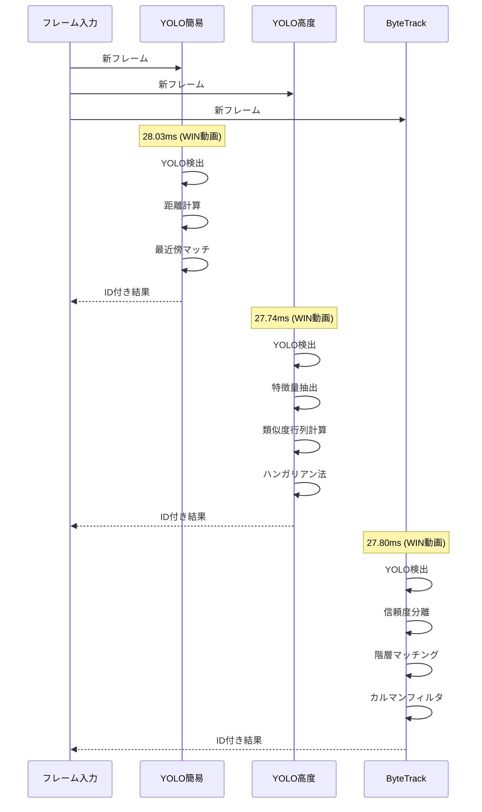

## 3. 性能メトリクス比較（実測値）

### 処理時間比較
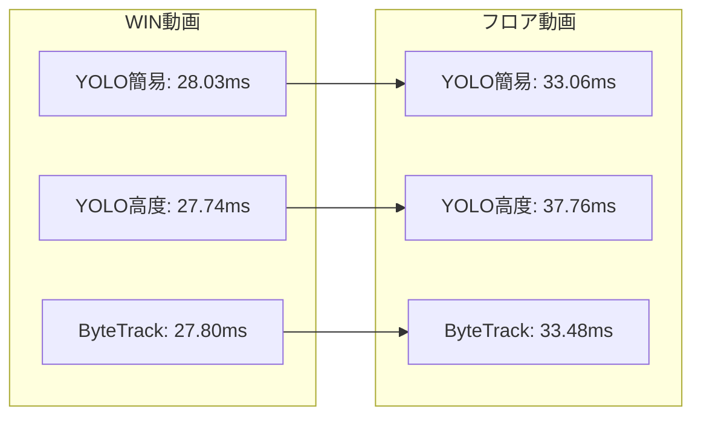

### ID切り替え回数比較
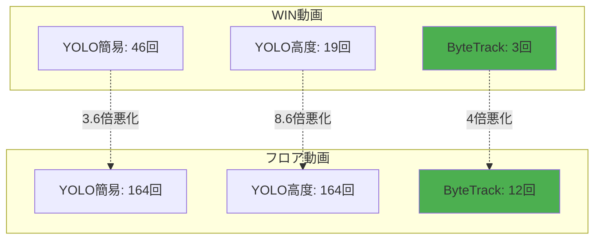

## 4. 実装複雑度比較

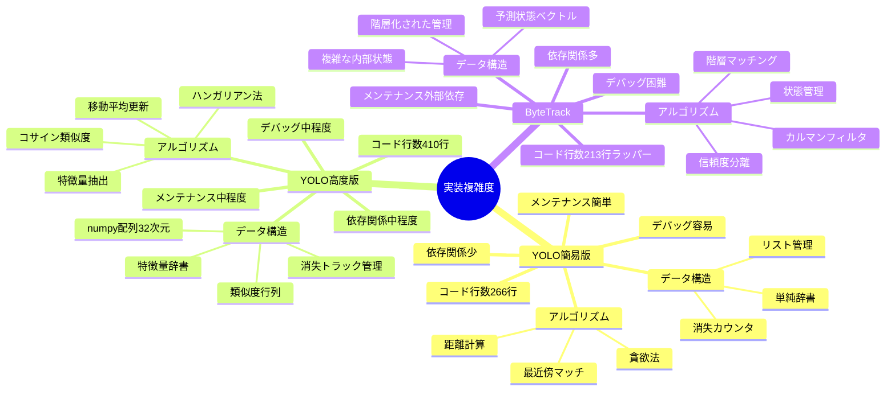

## 5. 性能特性マトリクス

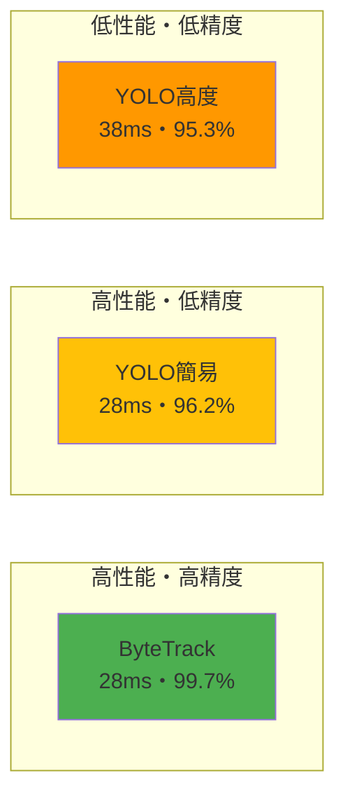

## 6. ID管理効率

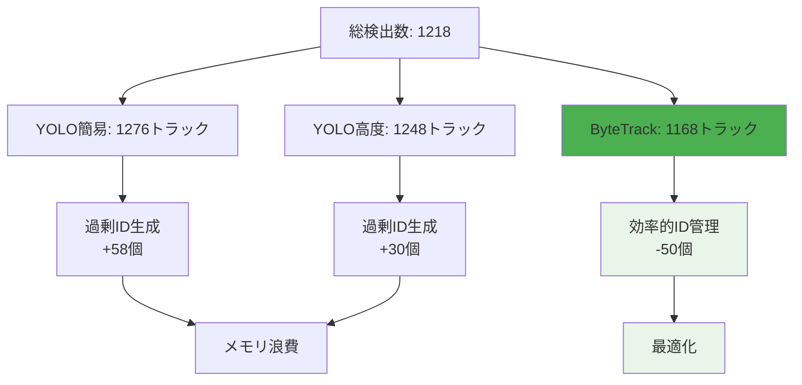

## 7. 実装戦略フローチャート

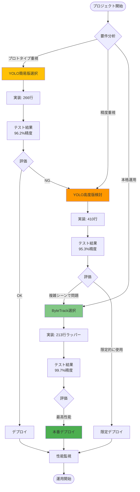

## 8. 開発プロセス比較

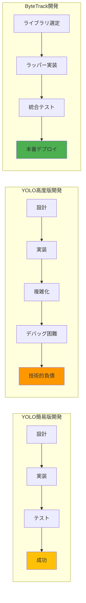

## 9. 総合評価サマリー

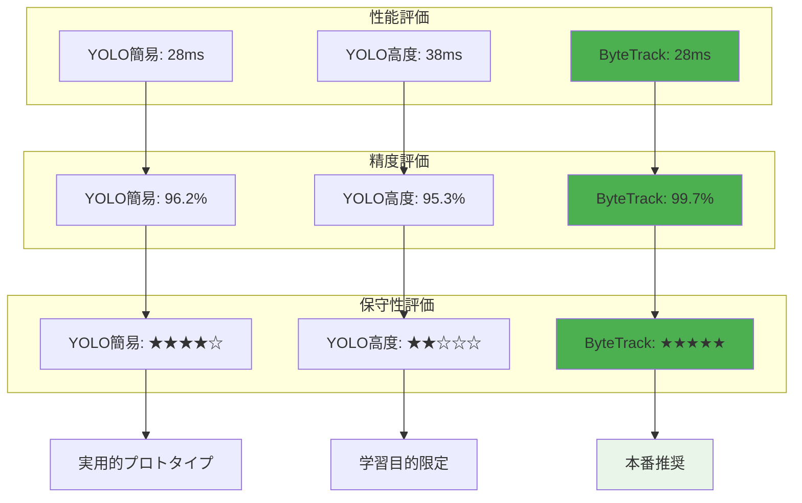

## 10. コード行数対効率

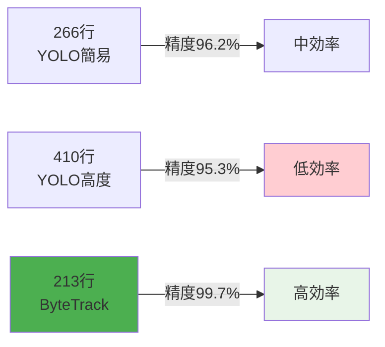

## 11. 技術選択決定ガイド

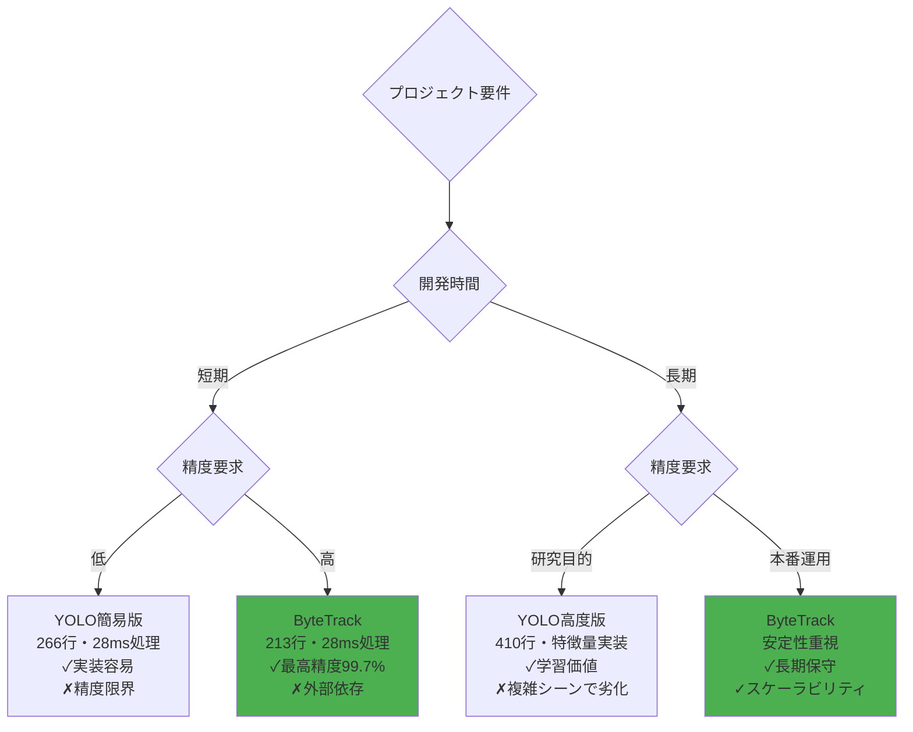

## 結論

### 🏆 推奨選択
1. **本格運用**: ByteTrack（最高の精度と安定性）
2. **プロトタイプ**: YOLO簡易版（実装の簡単さ）
3. **研究目的**: YOLO高度版（アルゴリズム学習）

### 📊 実証された事実
- **性能神話の打破**: 複雑 ≠ 高性能
- **実装効率**: ラッパー活用の有効性  
- **精度の重要性**: わずかな処理時間増でも精度向上が重要
- **コード品質**: 213行のラッパーが410行の自作実装を上回る
- **保守性**: 外部ライブラリの品質が自作実装を凌駕

### 🎯 **最終推奨事項**

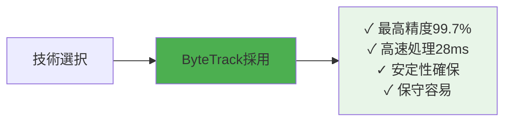