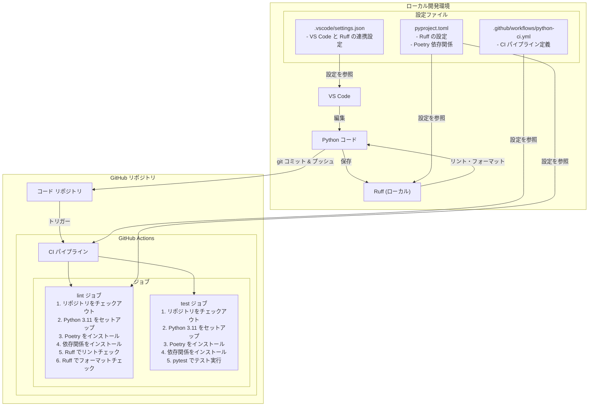
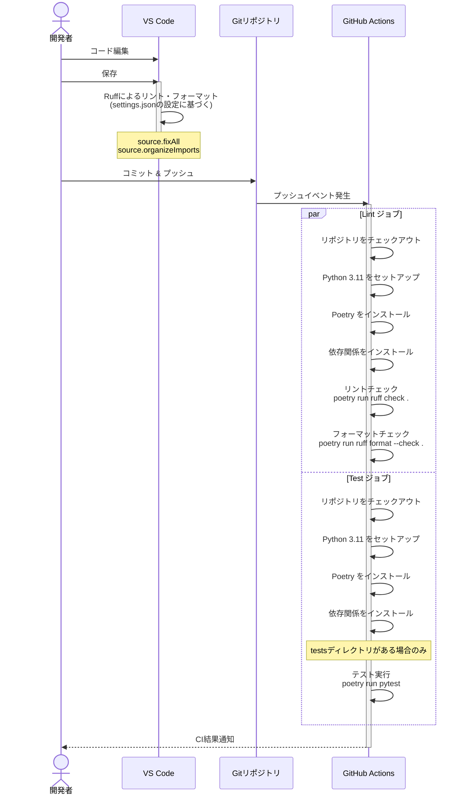

# コード品質管理システム

このドキュメントでは、プロジェクトに導入したコード品質管理システムのフロー図を示します。

## システム構成図

## ワークフローシーケンス図

## システム概要

このシステムは主に3つの重要な設定から構成されています：

1. **Ruff の設定** (`pyproject.toml`):
   - Python コードのリントとフォーマットのルールを定義
   - 最大行長、対象 Python バージョン、有効なリントルールを設定
   - コードスタイルの一貫性を保証

2. **GitHub Actions ワークフロー** (`.github/workflows/python-ci.yml`):
   - コードがプッシュされるたびに自動的に実行される CI パイプライン
   - リントとフォーマットチェックを行う **lint** ジョブ
   - 自動テストを実行する **test** ジョブ
   - 問題がある場合は早期に発見し通知

3. **VS Code の設定** (`.vscode/settings.json`):
   - ローカル開発環境での Ruff の挙動を定義
   - ファイル保存時の自動フォーマットと修正を設定
   - エディタ上でのリアルタイムフィードバックを提供

これにより、コードの品質を常に高い水準に維持するための継続的な検証システムが実現されています。開発中はリアルタイムにフィードバックを受け取り、コミット時には自動的に検証が行われます。 