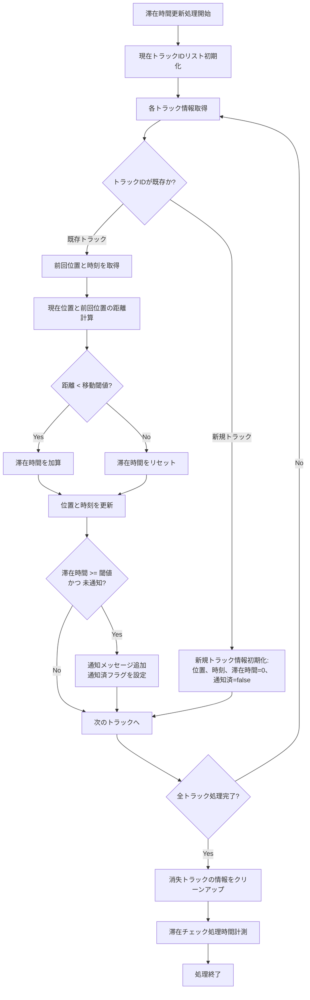

# 滞在時間検知スクリプト（detect_long_stay.py）のフローチャート

このフローチャートは、`scripts/detect_long_stay.py` スクリプトの処理フローを示しています。

## 基本処理フロー

```mermaid
graph TD
    A[処理開始] --> B(引数解析);
    B --> C{初期化処理};
    C --> D[YOLOモデル読み込み];
    D --> E[DeepSORTトラッカー初期化];
    E --> F[動画ファイルを開く];
    F --> G[出力動画ファイル準備];
    G --> H{パフォーマンスログ初期化 (有効な場合)};
    H --> I{フレーム処理ループ開始};

    I --> J[フレーム読み込み];
    J -- 読み込み失敗 --> S[リソース解放];
    J -- 読み込み成功 --> K[フレーム前処理 (BGR to RGB)];
    K --> L[YOLO: 人物検出];
    L --> M[DeepSORT: 追跡更新];
    M --> N[滞在情報更新];
    N --> O{長時間滞在チェック};
    O -- 滞在閾値超え --> P[通知メッセージ出力];
    O -- 閾値以下 --> Q[結果描画 (BBox, ID, 滞在時間)];
    P --> Q;
    Q --> R{パフォーマンスログ記録 (有効な場合)};
    R --> T[出力動画へフレーム書き込み];
    T --> U{プレビュー表示 (有効な場合)};
    U -- 'q'キー押下 --> S;
    U -- その他 --> I;

    S --> V[結果サマリ表示];
    V --> W[処理終了];
```

## 滞在時間検知の詳細フロー



## スクリプト使用方法

`detect_long_stay.py` スクリプトは、以下の形式で実行します：

```
python scripts/detect_long_stay.py --input-mp4 <入力動画ファイル> --output-mp4 <出力動画ファイル> [オプション]
```

主なオプション：
- `--model` - 使用するYOLOモデルのパス (デフォルト: models/yolov8n.pt)
- `--stay-threshold` - 滞在通知を行う時間の閾値 (秒, デフォルト: 4.0)
- `--move-threshold` - 同一場所とみなす移動距離の閾値 (ピクセル, デフォルト: 20.0)
- `--enable-perf-log` - パフォーマンスログをCSVに出力
- `--enable-video-display` - 処理中のプレビューを表示
- `--device` - 使用するデバイス (例: cpu, 0, '') 

## バウンディングボックスと中心点の図示

以下の図は、検出されたバウンディングボックスの四隅と中心点の関係を示します。

```mermaid
flowchart TB
  subgraph バウンディングボックス
    UL((x1, y1)) --> UR((x2, y1))
    UL --> LL((x1, y2))
    UR --> LR((x2, y2))
    LL --> LR
  end
  UL --- C(( "中心点<br/>((x1 + x2) / 2, (y1 + y2) / 2)" ))
  UR --- C
  LL --- C
  LR --- C
```

 