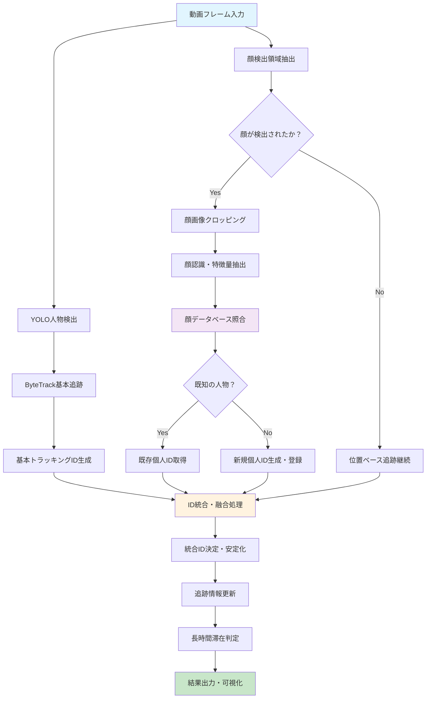
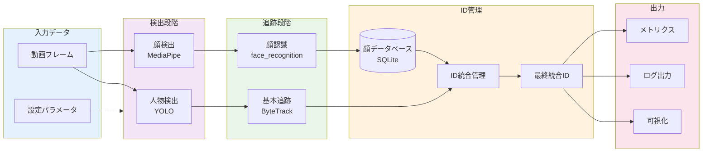
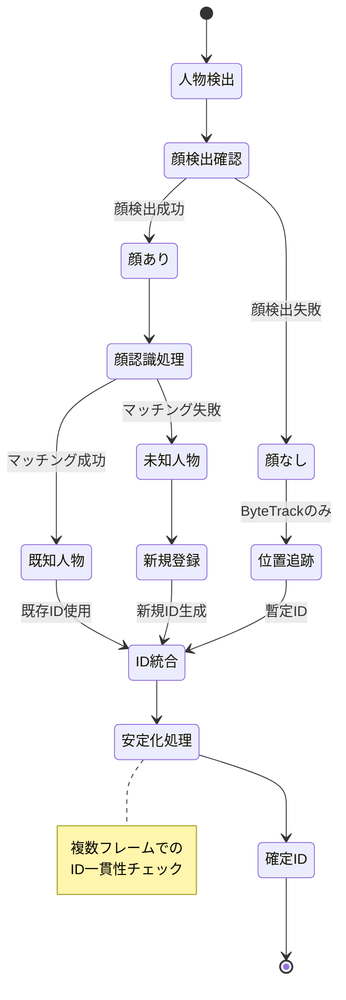
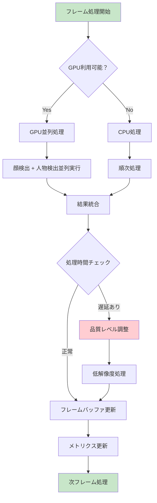
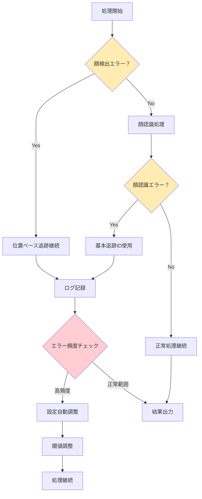
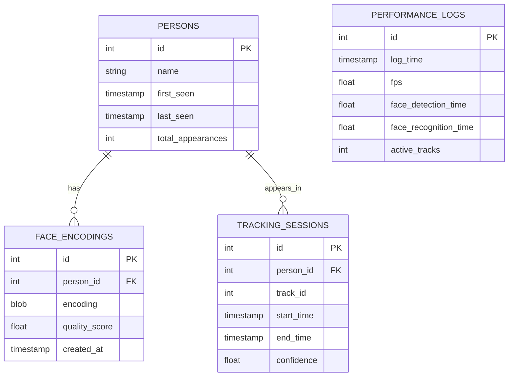

# 顔認識統合ID付与システム - アーキテクチャ図

## システム全体フロー

```mermaid
graph TD
    A[動画フレーム入力] --> B[YOLO人物検出]
    B --> C[ByteTrack基本追跡]
    C --> D[基本トラッキングID生成]
    
    A --> E[顔検出領域抽出]
    E --> F{顔が検出されたか？}
    F -->|Yes| G[顔画像クロッピング]
    F -->|No| H[位置ベース追跡継続]
    
    G --> I[顔認識・特徴量抽出]
    I --> J[顔データベース照合]
    J --> K{既知の人物？}
    K -->|Yes| L[既存個人ID取得]
    K -->|No| M[新規個人ID生成・登録]
    
    D --> N[ID統合・融合処理]
    L --> N
    M --> N
    H --> N
    
    N --> O[統合ID決定・安定化]
    O --> P[追跡情報更新]
    P --> Q[長時間滞在判定]
    Q --> R[結果出力・可視化]
    
    style A fill:#e1f5fe
    style R fill:#c8e6c9
    style N fill:#fff3e0
    style J fill:#f3e5f5
```

## データフロー詳細

```mermaid
flowchart LR
    subgraph Input["入力データ"]
        V[動画フレーム]
        C[設定パラメータ]
    end
    
    subgraph Detection["検出段階"]
        PD[人物検出<br/>YOLO]
        FD[顔検出<br/>MediaPipe]
    end
    
    subgraph Tracking["追跡段階"]
        BT[基本追跡<br/>ByteTrack]
        FR[顔認識<br/>face_recognition]
    end
    
    subgraph Management["ID管理"]
        DB[(顔データベース<br/>SQLite)]
        IM[ID統合管理]
        ID[最終統合ID]
    end
    
    subgraph Output["出力"]
        VIS[可視化]
        LOG[ログ出力]
        METRICS[メトリクス]
    end
    
    V --> PD
    V --> FD
    C --> Detection
    
    PD --> BT
    FD --> FR
    
    BT --> IM
    FR --> DB
    DB --> IM
    IM --> ID
    
    ID --> VIS
    ID --> LOG
    ID --> METRICS
    
    style Input fill:#e3f2fd
    style Detection fill:#f3e5f5
    style Tracking fill:#e8f5e8
    style Management fill:#fff3e0
    style Output fill:#fce4ec
```

## ID統合アルゴリズム

```mermaid
stateDiagram-v2
    [*] --> 人物検出
    人物検出 --> 顔検出確認
    
    顔検出確認 --> 顔あり: 顔検出成功
    顔検出確認 --> 顔なし: 顔検出失敗
    
    顔あり --> 顔認識処理
    顔認識処理 --> 既知人物: マッチング成功
    顔認識処理 --> 未知人物: マッチング失敗
    
    既知人物 --> ID統合: 既存ID使用
    未知人物 --> 新規登録
    新規登録 --> ID統合: 新規ID生成
    
    顔なし --> 位置追跡: ByteTrackのみ
    位置追跡 --> ID統合: 暫定ID
    
    ID統合 --> 安定化処理
    安定化処理 --> 確定ID
    確定ID --> [*]
    
    note right of 安定化処理
        複数フレームでの
        ID一貫性チェック
    end note
```

## パフォーマンス最適化フロー

```mermaid
graph TD
    A[フレーム処理開始] --> B{GPU利用可能？}
    B -->|Yes| C[GPU並列処理]
    B -->|No| D[CPU処理]
    
    C --> E[顔検出 + 人物検出並列実行]
    D --> F[順次処理]
    
    E --> G[結果統合]
    F --> G
    
    G --> H{処理時間チェック}
    H -->|遅延あり| I[品質レベル調整]
    H -->|正常| J[フレームバッファ更新]
    
    I --> K[低解像度処理]
    K --> J
    
    J --> L[メトリクス更新]
    L --> M[次フレーム処理]
    
    style A fill:#c8e6c9
    style M fill:#c8e6c9
    style I fill:#ffcdd2
```

## エラーハンドリング

```mermaid
graph TD
    A[処理開始] --> B{顔検出エラー？}
    B -->|Yes| C[位置ベース追跡継続]
    B -->|No| D[顔認識処理]
    
    D --> E{顔認識エラー？}
    E -->|Yes| F[基本追跡ID使用]
    E -->|No| G[正常処理継続]
    
    C --> H[ログ記録]
    F --> H
    G --> I[結果出力]
    
    H --> J{エラー頻度チェック}
    J -->|高頻度| K[設定自動調整]
    J -->|正常範囲| I
    
    K --> L[閾値調整]
    L --> M[処理継続]
    
    style B fill:#ffecb3
    style E fill:#ffecb3
    style J fill:#ffcdd2
```

## データベーススキーマ関係図

```mermaid
erDiagram
    PERSONS {
        int id PK
        string name
        timestamp first_seen
        timestamp last_seen
        int total_appearances
    }
    
    FACE_ENCODINGS {
        int id PK
        int person_id FK
        blob encoding
        float quality_score
        timestamp created_at
    }
    
    TRACKING_SESSIONS {
        int id PK
        int person_id FK
        int track_id
        timestamp start_time
        timestamp end_time
        float confidence
    }
    
    PERFORMANCE_LOGS {
        int id PK
        timestamp log_time
        float fps
        float face_detection_time
        float face_recognition_time
        int active_tracks
    }
    
    PERSONS ||--o{ FACE_ENCODINGS : "has"
    PERSONS ||--o{ TRACKING_SESSIONS : "appears_in"
``` 