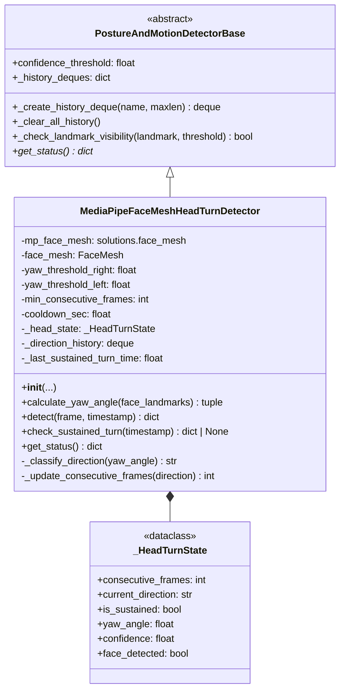
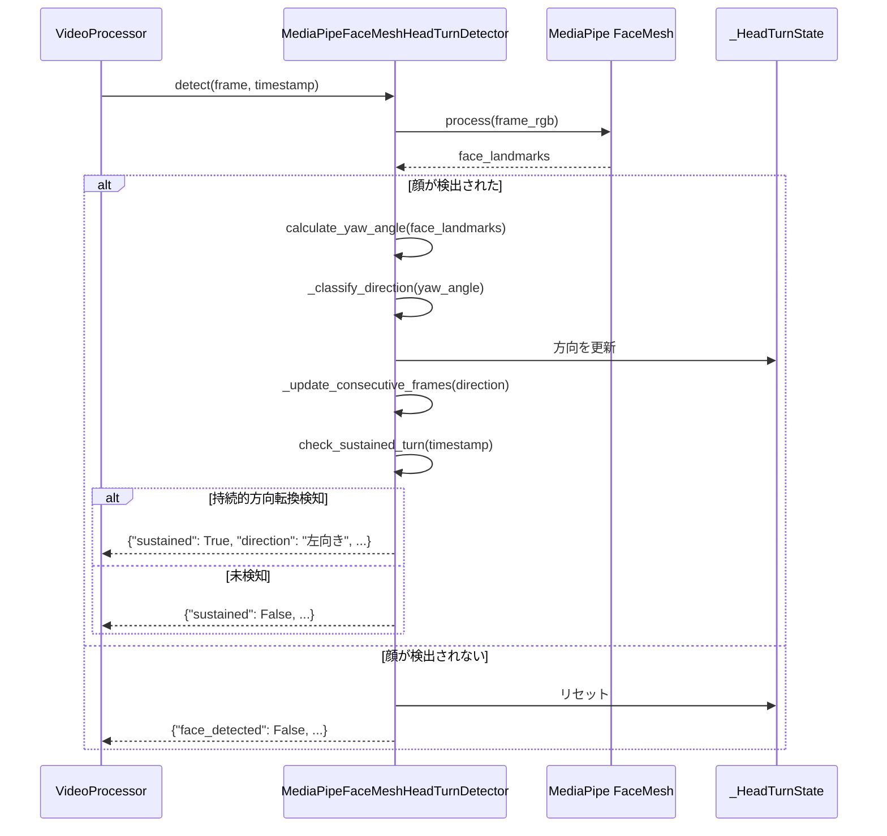
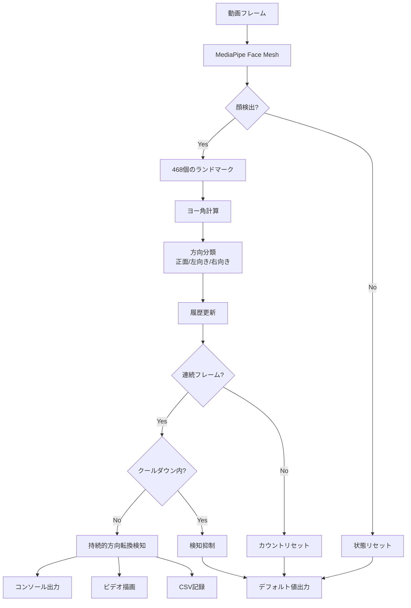

# MediaPipe Face Mesh 頭部方向検知システム 詳細設計書

## 文書情報

- **作成日**: 2025-01-28
- **バージョン**: 1.0
- **ステータス**: Draft
- **関連文書**: `docs/requirements/mediapipe_head_turn_requirements.md`

## 1. システム概要

MediaPipe Face Meshの468個の顔ランドマークを使用して、頭部の方向（左向き・右向き・正面）を高精度で検知するシステム。既存の`PostureAndMotionDetectorBase`を継承し、`HandRaiseDetector`と同様のアーキテクチャで実装する。

## 2. アーキテクチャ設計

### 2.1 クラス図



### 2.2 シーケンス図



### 2.3 データフロー図



## 3. アルゴリズム詳細

### 3.1 ヨー角計算アルゴリズム

MediaPipe Face Meshのランドマークから頭部のヨー角を計算します。

#### 使用するランドマーク
- **鼻先 (Nose tip)**: Landmark #1
- **左耳 (Left ear)**: Landmark #234
- **右耳 (Right ear)**: Landmark #454

#### 計算式

```
1. 耳の中点を計算:
   ear_midpoint_x = (left_ear.x + right_ear.x) / 2
   ear_midpoint_y = (left_ear.y + right_ear.y) / 2

2. 耳間距離を計算:
   ear_distance = sqrt((right_ear.x - left_ear.x)² + (right_ear.y - left_ear.y)²)

3. 鼻先のオフセットを計算:
   offset_x = nose.x - ear_midpoint_x

4. 正規化されたオフセット比率:
   offset_ratio = offset_x / ear_distance

5. ヨー角に変換（-90度〜+90度の範囲）:
   yaw_angle = offset_ratio × 90

where:
  - yaw_angle > 0: 右向き
  - yaw_angle < 0: 左向き
  - yaw_angle ≈ 0: 正面
```

#### 信頼度の計算

```
confidence = min(nose.visibility, left_ear.visibility, right_ear.visibility)
```

### 3.2 方向分類アルゴリズム

```python
def _classify_direction(yaw_angle: float) -> str:
    if yaw_angle >= yaw_threshold_right:  # デフォルト: 20度
        return "右向き"
    elif yaw_angle <= yaw_threshold_left:  # デフォルト: -20度
        return "左向き"
    else:
        return "正面"
```

### 3.3 連続フレーム判定アルゴリズム

```python
def _update_consecutive_frames(current_direction: str) -> int:
    # 履歴に現在の方向を追加
    direction_history.append(current_direction)
    
    # 前回と同じ方向ならカウントアップ
    if current_direction == previous_direction:
        consecutive_frames += 1
    else:
        consecutive_frames = 1
    
    # 閾値以上なら持続的方向転換
    if consecutive_frames >= min_consecutive_frames:
        is_sustained = True
    
    return consecutive_frames
```

### 3.4 クールダウン管理

```python
def check_sustained_turn(timestamp: float) -> dict | None:
    if not is_sustained:
        return None
    
    # クールダウン期間内なら検知しない
    if (timestamp - last_sustained_turn_time) < cooldown_sec:
        return None
    
    # 検知イベントを生成
    last_sustained_turn_time = timestamp
    return {
        "detected": True,
        "direction": current_direction,
        "frames": consecutive_frames,
        "timestamp": timestamp,
        "yaw_angle": yaw_angle
    }
```

## 4. データ構造設計

### 4.1 _HeadTurnState データクラス

```python
@dataclass
class _HeadTurnState:
    """頭部方向の内部状態を保持"""
    consecutive_frames: int = 0        # 連続検知フレーム数
    current_direction: str = "正面"     # 現在の方向
    is_sustained: bool = False         # 持続的方向転換フラグ
    yaw_angle: float = 0.0            # 最新のヨー角
    confidence: float = 0.0           # ランドマーク信頼度
    face_detected: bool = False       # 顔検出フラグ
```

### 4.2 detect()メソッドの戻り値

```python
{
    "face_detected": bool,              # 顔が検出されたか
    "yaw_angle": float,                 # ヨー角（度）
    "direction": str,                   # 方向（"正面" / "左向き" / "右向き"）
    "consecutive_frames": int,          # 連続フレーム数
    "confidence": float,                # 信頼度（0.0-1.0）
    "is_sustained": bool                # 持続的方向転換フラグ
}
```

### 4.3 check_sustained_turn()メソッドの戻り値

```python
{
    "detected": True,                   # 検知フラグ
    "direction": str,                   # 検知された方向
    "frames": int,                      # 継続フレーム数
    "timestamp": float,                 # タイムスタンプ（秒）
    "yaw_angle": float                  # ヨー角（度）
} or None  # 検知なしの場合
```

## 5. パラメータ設計

### 5.1 デフォルトパラメータ

| パラメータ名 | デフォルト値 | 単位 | 説明 |
|-------------|------------|------|------|
| `yaw_threshold_right` | 20.0 | 度 | 右向き判定の閾値 |
| `yaw_threshold_left` | -20.0 | 度 | 左向き判定の閾値 |
| `min_consecutive_frames` | 3 | フレーム | 持続的方向転換の最小フレーム数 |
| `cooldown_sec` | 10.0 | 秒 | 再検知抑制期間 |
| `confidence_threshold` | 0.5 | - | ランドマーク信頼度閾値 |

### 5.2 閾値の最適化方針

正解データ（`data/annotations.csv`）を使用して閾値を最適化します。

1. **統計分析**:
   - ActionLabel="左向き"時のヨー角の分布を分析
   - ActionLabel="右向き"時のヨー角の分布を分析
   - ActionLabel="正面"時のヨー角の分布を分析

2. **閾値決定**:
   ```
   yaw_threshold_right = mean(右向きヨー角) - 1.0 × std(右向きヨー角)
   yaw_threshold_left = mean(左向きヨー角) + 1.0 × std(左向きヨー角)
   ```

3. **検証**:
   - F1-Scoreが最大になる閾値を探索
   - 混同行列で誤検知パターンを分析

## 6. 統合設計

### 6.1 VideoProcessorへの統合

#### PipelineStateの拡張

```python
@dataclass
class PipelineState:
    pose: PoseEstimator
    analyzer: MovementAnalyzer
    # ... 既存フィールド ...
    mediapipe_head_turn_detector: MediaPipeFaceMeshHeadTurnDetector | None = None
```

#### VideoProcessor.__init__の拡張

```python
def __init__(
    self,
    # ... 既存パラメータ ...
    enable_mediapipe_head_turn: bool = False,
    mediapipe_yaw_threshold_right: float = 20.0,
    mediapipe_yaw_threshold_left: float = -20.0,
):
    self.enable_mediapipe_head_turn = enable_mediapipe_head_turn
    # ...
```

#### _process_single_frame()の拡張

```python
# MediaPipe頭部方向検知（オプション）
if state.mediapipe_head_turn_detector:
    mp_result = state.mediapipe_head_turn_detector.detect(frame, timestamp)
    
    # 持続的方向転換チェック
    sustained_turn = state.mediapipe_head_turn_detector.check_sustained_turn(timestamp)
    if sustained_turn:
        print(f"[MediaPipe] {sustained_turn['direction']}を検知 "
              f"({sustained_turn['frames']}フレーム継続)")
```

### 6.2 CSV出力への統合

#### setup_csv_writer()の拡張

```python
fieldnames = [
    # ... 既存フィールド ...
    "mediapipe_yaw_angle",
    "mediapipe_face_detected",
    "mediapipe_turn_direction",
    "mediapipe_sustained_turn_detected",
    "mediapipe_sustained_direction",
    "mediapipe_sustained_frames",
]
```

#### write_results_to_csv()の拡張

```python
# MediaPipe headturn results
if mediapipe_head_turn_detector:
    status = mediapipe_head_turn_detector.get_status()
    row.update({
        "mediapipe_yaw_angle": status.get("yaw_angle", 0.0),
        "mediapipe_face_detected": status.get("face_detected", False),
        "mediapipe_turn_direction": status.get("direction", ""),
        "mediapipe_sustained_turn_detected": status.get("is_sustained", False),
        "mediapipe_sustained_direction": status.get("current_direction", ""),
        "mediapipe_sustained_frames": status.get("consecutive_frames", 0),
    })
```

### 6.3 描画への統合

#### draw_mediapipe_head_turn_info()の新規追加

```python
def draw_mediapipe_head_turn_info(
    frame: np.ndarray,
    mediapipe_detector: MediaPipeFaceMeshHeadTurnDetector | None,
    disable_jp: bool = False
) -> np.ndarray:
    """MediaPipe検出結果を描画"""
    if not mediapipe_detector:
        return frame
    
    status = mediapipe_detector.get_status()
    
    # ヨー角表示
    yaw_text = f"Yaw: {status['yaw_angle']:.1f}°"
    cv2.putText(frame, yaw_text, (20, 180), ...)
    
    # 方向表示（色分け）
    direction = status['direction']
    if direction == "左向き":
        color = (255, 0, 0)  # 青
    elif direction == "右向き":
        color = (0, 0, 255)  # 赤
    else:
        color = (0, 255, 0)  # 緑
    
    if disable_jp:
        dir_text = f"Direction: {direction}"
    else:
        dir_text = f"方向: {direction}"
    
    frame = draw_japanese_text(frame, dir_text, (20, 210), 24, color)
    
    # 持続的方向転換アラート
    if status['is_sustained']:
        alert_text = f"🎯 {direction}検知!" if not disable_jp else f"🎯 {direction} DETECTED!"
        frame = draw_japanese_text(frame, alert_text, (50, frame.shape[0] - 100), 48, color)
    
    return frame
```

## 7. エラーハンドリング

### 7.1 例外処理方針

| エラーケース | 処理方法 |
|------------|---------|
| MediaPipe初期化失敗 | 警告ログ出力、検出器をNoneに設定 |
| 顔検出失敗（フレーム単位） | 状態リセット、デフォルト値を返す |
| ランドマーク不足 | 信頼度0.0、デフォルト値を返す |
| ヨー角計算エラー | 0.0度を返す、エラーログ出力 |

### 7.2 ログ出力方針

- **INFO**: 持続的方向転換検知時
- **DEBUG**: フレームごとのヨー角と方向
- **WARNING**: MediaPipe初期化失敗、ランドマーク不足
- **ERROR**: 予期しない例外

## 8. テスト設計

### 8.1 ユニットテスト

#### test_calculate_yaw_angle
- 正面向きの顔（ヨー角≈0度）
- 右向きの顔（ヨー角 > 20度）
- 左向きの顔（ヨー角 < -20度）
- ランドマーク不足時のエラーハンドリング

#### test_classify_direction
- 各閾値境界値のテスト
- 閾値の変更が反映されることの確認

#### test_consecutive_frames
- 連続した同じ方向の検知
- 方向が変わった時のカウントリセット
- 閾値フレーム数での持続的方向転換検知

#### test_cooldown
- クールダウン期間内の再検知抑制
- クールダウン期間経過後の再検知

### 8.2 統合テスト

- 実動画（国宝さん首振り1.mp4）での検知テスト
- 正解データとの精度比較
- 他の検出器（YOLO11 Pose）との並行動作確認

## 9. 性能設計

### 9.1 処理時間目標

- MediaPipe Face Mesh処理: 10ms以内
- ヨー角計算: 1ms以内
- 全体処理時間: 15ms以内（30fps対応）

### 9.2 メモリ使用量

- 履歴deque: 最大60フレーム分（約480バイト）
- MediaPipe内部バッファ: 約10MB
- 合計: 15MB以内

## 10. 拡張設計

### 10.1 将来の機能拡張

1. **複数回の首振りカウント**:
   - 左→右→左の往復回数をカウント
   - `oscillation_count`フィールドを追加

2. **ピッチ角（上下方向）の検知**:
   - うなずき検知への拡張
   - `pitch_angle`と`vertical_direction`を追加

3. **複数人対応**:
   - 複数の顔を同時に追跡
   - 人物IDと紐付け

### 10.2 設定ファイル対応

`config.yaml`への統合:

```yaml
mediapipe_head_turn_detector:
  enabled: true
  yaw_threshold_right: 20.0
  yaw_threshold_left: -20.0
  min_consecutive_frames: 3
  cooldown_sec: 10.0
  confidence_threshold: 0.5
```

## 11. 参考資料

- [MediaPipe Face Mesh ランドマーク図](https://github.com/google/mediapipe/blob/master/docs/solutions/face_mesh.md)
- `src/detectors/base_detector.py`: 基底クラス実装
- `src/detectors/hand_raise_refactored.py`: 参考実装
- `docs/requirements/mediapipe_head_turn_requirements.md`: 要件定義書

