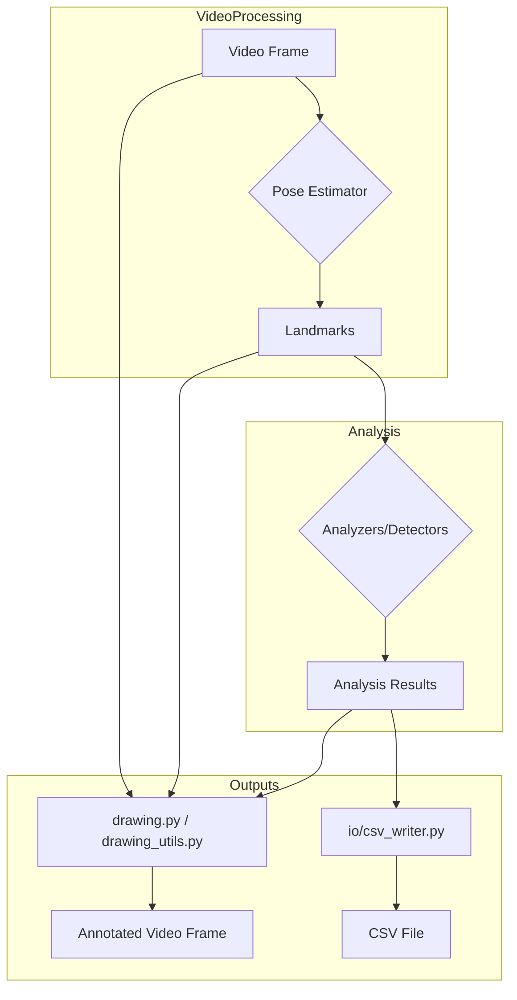

# `drawing_utils.py`, `io/drawing.py`, `io/csv_writer.py` の比較分析

## 1. はじめに

本ドキュメントは、プロジェクト内に存在する3つのユーティリティファイル、`src/drawing_utils.py`、`src/io/drawing.py`、および `src/io/csv_writer.py` の役割と内容を比較・分析し、コードベースの理解を深めることを目的とします。

## 2. 各ファイルの役割概要

-   **`src/drawing_utils.py`**: 画像フレーム上に、骨格、分析結果、滞在検知ステータス、挙手ステータスなどの情報を描画するための関数を提供します。
-   **`src/io/drawing.py`**: `drawing_utils.py` と同様に、画像フレーム上への情報描画を目的としますが、より統合的な描画関数（複数の検出器情報を一度に描画）も含んでいます。
-   **`src/io/csv_writer.py`**: 分析結果（関節角度、姿勢状態、滞在時間など）をCSVファイルに書き出すための関数を提供します。データの永続化を担います。

## 3. `src/drawing_utils.py` と `src/io/drawing.py` の詳細比較

これら2つのファイルは、機能的に非常に重複度が高いです。

### 3.1 共通点

以下の関数および定数が両方のファイルにほぼ同一の内容で存在します。

-   **共通関数**:
    -   `draw_japanese_text()`: Pillowライブラリを使用して日本語テキストを描画する。
    -   `draw_landmarks()`: 骨格のランドマークと接続線を描画する。
    -   `draw_analysis_results()`: 関節角度や動作状態などの分析結果テキストを描画する。
-   **共通定数**:
    -   `CONNECTIONS`: 骨格の接続情報。
    -   `ANGLE_JP`, `MOVEMENT_STATE_JP`: Enumと日本語名のマッピング。

この高い重複度は、開発の過程でコードが分岐またはコピーされた可能性を示唆しており、保守性の観点からは課題となります。

### 3.2 差異点

| 機能/関数                     | `src/drawing_utils.py` | `src/io/drawing.py` | 備考                                                                   |
| ------------------------------- | :--------------------: | :-----------------: | ---------------------------------------------------------------------- |
| **滞在ステータス描画**          |          `○`           |        `—`        | `draw_dwell_status()` が存在する。                                     |
| **挙手ステータス描画**          |          `○`           |        `—`        | `draw_hand_raise_status()` が存在する。                                |
| **統合的な検知情報描画**        |          `—`           |        `○`        | `draw_detection_info()` が存在し、複数の検出器の結果を一度に描画する。 |
| **`draw_landmarks` の戻り値** |         `None`         |    `np.ndarray`     | `io/drawing.py` は変更後の画像を返すため、より一貫性がある。           |

### 3.3 考察と推奨事項

`drawing_utils.py` は `run_hand_raise.py` のような特定のスクリプトに特化した描画処理、`io/drawing.py` はより汎用的な描画処理、という棲み分けになっている可能性があります。

しかし、コードの重複はバグの温床となり、修正漏れを引き起こすリスクがあります。
**推奨事項:** これら2つのファイルを1つの汎用的な描画ユーティリティモジュール（例: `src/common/drawing.py`）に統合することを強く推奨します。統合により、コードの再利用性が高まり、保守性が向上します。

## 4. `src/io/csv_writer.py` と描画ファイルの比較

`csv_writer.py` は、他の2つの描画ファイルとは明確に異なる役割を持ちます。

-   **目的**:
    -   `csv_writer.py`: 分析結果の**データ永続化**。フレームごとの詳細な数値をCSV形式で保存する。
    -   描画ファイル: 分析結果の**リアルタイム可視化**。ビデオフレーム上に情報を描画し、視覚的なフィードバックを提供する。
-   **入力**:
    -   両者とも、`movement_analyzer` などで計算された `analysis_results` 辞書や、各種検出器オブジェクトを共通の入力として受け取ります。
-   **出力**:
    -   `csv_writer.py`: `results.csv` のようなファイル。
    -   描画ファイル: テキストや図形が描画された画像フレーム (`np.ndarray`)。

## 5. 全体像とデータの流れ

以下に、各ファイルの関連性を Mermaid フローチャートで示します。

## 6. まとめ

-   `src/drawing_utils.py` と `src/io/drawing.py` は機能が大幅に重複しており、**リファクタリングによる統合**が望まれます。
-   `src/io/csv_writer.py` は、描画ファイルとは役割が明確に異なり、分析結果のデータ出力という重要な役割を担っています。
-   3つのファイルは、姿勢推定後の分析結果を共通の入力として利用しており、分析パイプラインの異なる出力形式（可視化・データ化）を担当しています。

