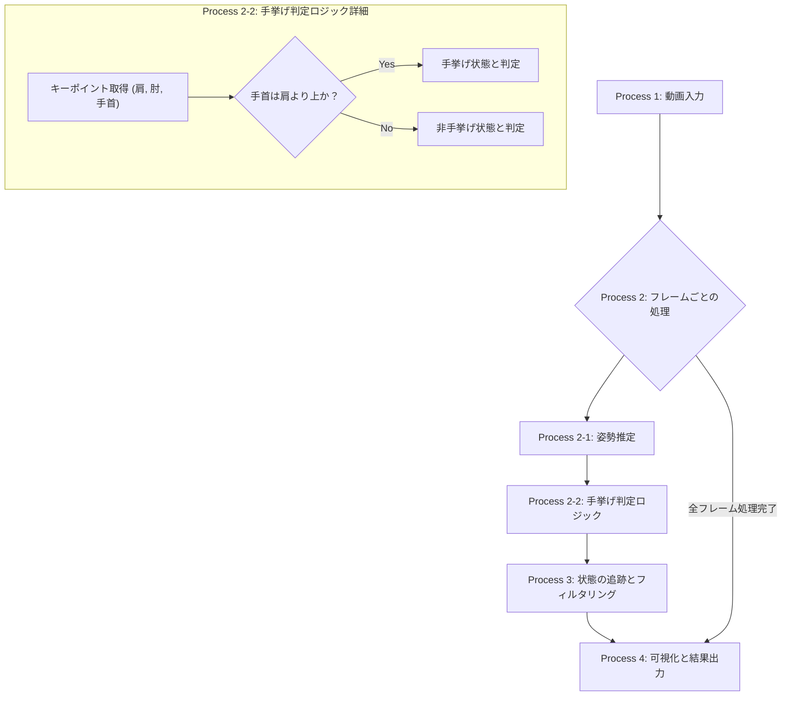
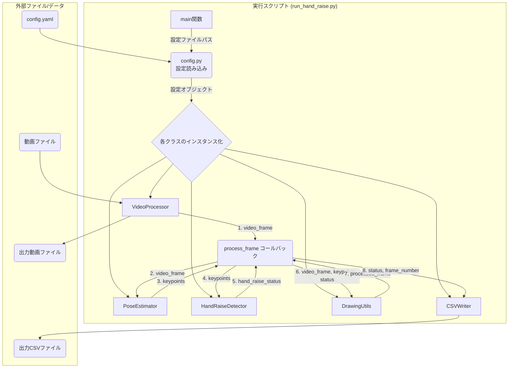

# 手挙げ検出アルゴリズム仕様書

## 1. 概要

本ドキュメントは、動画フレームから人物の「手を挙げている」状態を検出するアルゴリズムの仕様を定義する。
姿勢推定技術を用いて人物の関節キーポイントを検出し、手首、肘、肩の位置関係に基づいて手挙げ状態を判定する。

## 2. アルゴリズムフロー

以下に、手挙げ検出アルゴリズムの全体的な処理フローを示す。



## 3. 各プロセスの詳細

### Process 1: 動画入力
-   処理対象の動画ファイルを読み込む。
-   検出アルゴリズムで使用する設定値（閾値など）を `config.yaml` から読み込む。

### Process 2: フレームごとの処理
動画をフレーム単位で読み込み、後続の処理をループ実行する。

#### Process 2-1: 姿勢推定
-   `PoseEstimator` を利用し、フレーム内の各人物の姿勢キーポイント（肩、肘、手首など）を検出する。

#### Process 2-2: 手挙げ判定ロジック
-   検出されたキーポイントの座標を用いて、手が挙がっているかを判定する。
-   **判定条件**:
    1.  **主要条件**: 手首のy座標が、肩のy座標よりも上にあること。
    2.  **補助条件**: 判定対象キーポイント（手首、肩）が一定以上の信頼度スコアで検出されていること。
-   この判定を、左右の腕それぞれに対して独立して行う。

### Process 3: 状態の追跡とフィルタリング
-   瞬間的な誤検出を防ぎ、安定した結果を得るために、時間的なフィルタリングを行う。
-   各人物の各腕について、手挙げ状態が何フレーム連続しているかをカウントする。
-   連続カウントが事前に定義した閾値（例: 5フレーム）を超えた場合にのみ、正式な「手挙げイベント」として確定する。

### Process 4: 可視化と結果出力
-   **動画出力**:
    -   手挙げ状態と判定された人物の骨格（ランドマーク）を描画する。
    -   状態（例: "Right Hand Up"）をテキストで描画する。
    -   処理結果を反映した新しい動画ファイルを生成する。
-   **データ出力**:
    -   手挙げイベントが開始・終了したフレーム番号や時刻をCSVファイルなどの構造化データとして出力する。

## 4. 依存関係とデータフロー

本アルゴリズムは、既存の`src`配下モジュール、外部ライブラリ、および特定のデータフローに依存する。

### 4.1. 内部モジュール依存

本機能の実装は、以下の`src`配下の既存モジュールに依存する。

-   **`config.py`**:
    -   役割: 検出に使用するモデルのパス、キーポイントの信頼度閾値、手挙げ判定の連続フレーム数などの設定値を管理する。
-   **`video_processor.py` (`VideoProcessor`クラス)**:
    -   役割: 動画ファイルの読み込み、フレームの切り出し、処理後の動画書き出しといった一連の動画処理パイプラインを提供する。
-   **`pose_estimator.py` (`PoseEstimator`クラス)**:
    -   役割: 入力されたフレームに対して姿勢推定モデル（MediaPipe）を実行し、人物のキーポイントデータを抽出する。
-   **`drawing_utils.py` (`DrawingUtils`クラス)**:
    -   役割: 処理中のフレームに対し、検出された人物のバウンディングボックスや「手挙げ」のステータステキストを描画する。
-   **`io_utils.py` (`CSVWriter`クラス)**:
    -   役割: 検出された手挙げイベントのデータ（フレーム番号、状態など）をCSV形式でファイルに保存する。

### 4.2. 主要ライブラリ

-   **`mediapipe`**: GoogleのMediaPipeフレームワークを利用し、フレームから人物の姿勢ランドマーク（キーポイント）を検出する。
-   **`opencv-python`**: 動画の読み書き、フレーム操作、描画処理など、基本的な画像・動画処理に使用する。
-   **`numpy`**: キーポイントの座標計算など、数値演算に使用する。
-   **`pyyaml`**: `config.yaml`ファイルの読み込みに使用する。

### 4.3. データフロー詳細

以下に、アプリケーションの起動から結果が出力されるまでの一連のデータフローを詳細に記述する。

**フェーズ1: 初期化 (`run_hand_raise.py`内)**

1.  **設定読み込み**:
    *   `config.py`の`AppConfig`クラスが`config.yaml`を読み込み、アプリケーション全体の設定（`mediapipe`のモデル複雑度、手挙げ判定の閾値など）を保持するオブジェクトを生成する。
2.  **モジュールインスタンス化**:
    *   **`PoseEstimator`**: `config`から読み込んだモデル複雑度などのパラメータを基にインスタンス化される。
    *   **`HandRaiseDetector` (新規)**: 手挙げ判定に使用するキーポイントの信頼度閾値や、連続検出フレーム数の閾値を引数にインスタンス化される。
    *   **`VideoProcessor`**: 入力動画パス、出力動画パス、および後述の`process_frame`関数をコールバックとして受け取り、インスタンス化される。
    *   **`io_utils`**: 出力先のCSVファイルパスを引数に、CSV書き込み用のライターがセットアップされる。

**フェーズ2: フレームごとの処理ループ (`VideoProcessor`が担当)**

`VideoProcessor`が動画ファイルを開き、フレームがなくなるまで以下の`process_frame`関数を呼び出し続ける。

**`process_frame`(コールバック関数)内の処理:**

3.  **姿勢推定**:
    *   `VideoProcessor`から渡された単一のフレーム（`numpy.ndarray`）が`pose_estimator.estimate()`メソッドに渡される。
    *   メソッド内部でフレームはBGR形式からRGB形式に変換され、`mediapipe.solutions.pose.process()`で処理される。
    *   結果として、検出された人物の33個の姿勢ランドマークが`numpy.ndarray`（形状: `(33, 4)`、各行は`[x, y, z, visibility]`）として返される。人物が検出されなかった場合は`None`が返る。
4.  **手挙げ状態判定**:
    *   `PoseEstimator`から返された`landmarks`（`np.ndarray`または`None`）が`hand_raise_detector.detect()`メソッドに渡される。
    *   メソッド内部では、左右の肩と手首のランドマーク（例: `PoseLandmark.LEFT_SHOULDER`）の座標と`visibility`を取得する。
    *   `visibility`が設定閾値を超えていることを確認した上で、手首のy座標が肩のy座標より上にあるかを比較する。
    *   条件を満たしたフレームが連続した場合、内部カウンターがインクリメントされる。カウンターが設定閾値を超えた時点で、初めて「手挙げ状態」として確定する。
    *   返り値として、左右の腕の状態を示す辞書（例: `{'left_hand_up': True, 'right_hand_up': False}`）が返される。
5.  **結果の可視化**:
    *   元のフレーム、`landmarks`、および`hand_statuses`（手挙げ状態の辞書）が`drawing_utils`の関数に渡される。
    *   `draw_landmarks()`が呼ばれ、フレーム上に人物の骨格が描画される。
    *   `hand_statuses`の内容に応じて、`draw_japanese_text()`が呼ばれ、「左手 挙手」などのテキストがフレーム上に描画される。
6.  **結果の記録**:
    *   現在のフレーム番号と`hand_statuses`がCSVライターに渡され、`writerow()`でCSVファイルに新しい行として追記される。
7.  **フレーム返却**:
    *   描画処理が完了したフレームが`VideoProcessor`に返却される。`VideoProcessor`は、このフレームを出力動画ファイルに書き込む。

**フェーズ3: 終了処理**

*   全てのフレームの処理が完了すると、`VideoProcessor`は動画ファイルの読み込みと書き込みを終了し、リソースを解放する。CSVファイルもクローズされる。

### 4.4. データフロー図




## 5. データスキーマ

本アルゴリズムで使用する設定ファイル、モジュール間で受け渡されるデータ、および出力されるCSVファイルのデータ構造（スキーマ）を以下に定義する。

### 5.1. 設定ファイルスキーマ (`config.yaml`)

手挙げ検出機能に関するパラメータは、`config.yaml`内で`hand_raise`キーの下に記述することを想定する。

```yaml
hand_raise:
  # 姿勢ランドマークの信頼度(visibility)の閾値 (0.0 ~ 1.0)
  # この値未満の信頼度のキーポイントは判定に使用されない
  visibility_threshold: 0.5

  # 手挙げ状態として確定するために必要な最小連続フレーム数
  # チャタリング（瞬間的な誤検出）を防ぐためのパラメータ
  min_consecutive_frames: 5
```

### 5.2. モジュール間データスキーマ

#### 5.2.1. `PoseEstimator.estimate()` の出力

`PoseEstimator`は、フレームから人物を検出した場合、以下の構造を持つ`numpy.ndarray`を返す。検出できなかった場合は`None`を返す。

-   **データ型**: `numpy.ndarray` or `None`
-   **形状**: `(33, 4)`
-   **詳細**:
    -   33個の姿勢ランドマーク（`mediapipe.solutions.pose.PoseLandmark`に対応）の情報を格納する。
    -   各行は1つのランドマークに対応し、`[x, y, z, visibility]`の4つの要素を持つ。
        -   `x`, `y`, `z`: 0.0〜1.0に正規化された座標値。
        -   `visibility`: ランドマークの可視性・信頼度スコア（0.0〜1.0）。

#### 5.2.2. `HandRaiseDetector.detect()` の出力

`HandRaiseDetector`は、`PoseEstimator`からのランドマーク情報を受け取り、左右の腕の手挙げ状態を判定した結果を以下の辞書形式で返す。

-   **データ型**: `dict`
-   **キー**:
    -   `left_hand_raised` (string)
    -   `right_hand_raised` (string)
-   **値**:
    -   `True` or `False` (boolean)
-   **例**: `{'left_hand_raised': True, 'right_hand_raised': False}`

### 5.3. 出力CSVスキーマ (`hand_raise_results.csv`)

手挙げ検出の結果は、各フレームに対して以下のカラムを持つCSVファイルに出力される。

| カラム名              | データ型 | 説明                                           |
| :-------------------- | :------- | :--------------------------------------------- |
| `frame_number`        | integer  | 動画のフレーム番号（0始まり）                  |
| `timestamp`           | float    | 動画のタイムスタンプ（秒）                     |
| `left_hand_raised`    | boolean  | 左手が挙がっていると判定されたか (True/False)    |
| `right_hand_raised`   | boolean  | 右手が挙がっていると判定されたか (True/False)    |

