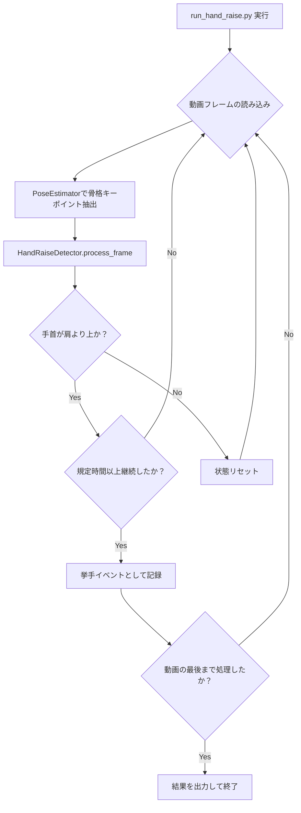

# 手をあげる動作検出機能 実装計画書

## 1. 目的

動画内の人物が「手をあげる」動作を検出するアルゴリズムを新規に実装する。この機能は、特定の注意喚起や意思表示のジェスチャーを自動で認識することを目的とする。

## 2. 実装方針

既存のシステム(`main_detector.py`)への影響を最小限に抑えつつ、安全かつ効率的に開発を進めるため、以下のハイブリッドアプローチを採用する。

1.  **検出ロジックの分離**: 手をあげる動作の検出ロジックを `src/hand_raise_detector.py` として独立したモジュールで実装する。
2.  **開発用実行ファイルの作成**: 開発とテストを迅速に行うため、プロジェクトルートに専用の実行ファイル `run_hand_raise.py` を作成する。
3.  **設定の集約**: 検出に使用する閾値などのパラメータは `src/config.py` に集約し、管理を容易にする。
4.  **最終的な統合**: 機能が安定稼働したのち、`main_detector.py` にコマンドライン引数で選択可能な検出器の一つとして統合する。

## 3. アーキテクチャ

処理の全体像は以下のフローチャートの通り。

## 4. ファイル構成の変更点

| ファイルパス                         | 状態     | 概要                                           |
| ---------------------------------- | -------- | ---------------------------------------------- |
| `run_hand_raise.py`                | **新規作成** | 開発・テスト用の実行ファイル。                 |
| `src/hand_raise_detector.py`       | **新規作成** | 手をあげる動作の検出ロジックを実装するクラス。 |
| `src/config.py`                    | **修正**   | 挙手判定の閾値など、関連する設定値を追加。     |
| `docs/hand_raise_implementation_plan.md` | **新規作成** | 本ドキュメント。                               |

## 5. 各モジュールの詳細設計

### 5.1. `src/hand_raise_detector.py`

-   **クラス名**: `HandRaiseDetector`
-   **責務**: 骨格キーポイント情報を受け取り、手をあげている状態を判定し、その期間を記録する。
-   **メソッド**:
    -   `__init__(self, config)`:
        -   設定情報(`config`)から、継続時間の閾値などをインスタンス変数として保持する。
        -   人物IDごとに、手をあげている状態（左右の手、開始フレーム）を管理する辞書を初期化する。
    -   `process_frame(self, frame_number, keypoints_data)`:
        -   フレーム番号と、そのフレームに存在する全人物のキーポイント情報を受け取る。
        -   人物ごとに `_check_hand_raise` を呼び出し、状態を更新する。
        -   検出された挙手イベント（ID、開始フレーム、終了フレーム、左右）のリストを返す。
    -   `_is_hand_raised(self, keypoints, side)`:
        -   片方の手について、手首が肩より上にあるかを判定するプライベートメソッド。
        -   `definitions.py` のキーポイントインデックスを利用する。
-   **状態管理**:
    -   各人物IDに対して、`{"left": {"is_raising": False, "start_frame": None}, "right": ...}` のような構造で状態を管理する。

### 5.2. `run_hand_raise.py`

-   **責務**: 動画ファイルを読み込み、`HandRaiseDetector` を使って処理を実行し、結果を出力する。
-   **処理内容**:
    1.  `argparse` を用いて、入力動画パス、出力先パスなどのコマンドライン引数を解析する。
    2.  `config.py` から設定をロードする。
    3.  `PoseEstimator` と `HandRaiseDetector` のインスタンスを生成する。
    4.  `VideoProcessor` を使って動画をフレームごとにループ処理する。
        -   `PoseEstimator` でキーポイントを抽出する。
        -   `HandRaiseDetector.process_frame` を呼び出し、結果を受け取る。
        -   （任意）`drawing_utils.py` を使って、検出結果をフレームに描画する。
    5.  ループ終了後、検出された全ての挙手イベントをCSVファイルに出力する。

### 5.3. `src/config.py`

-   以下の設定値を追加する。
    -   `HAND_RAISE_SECONDS_THRESHOLD`: 手をあげていると判定する最小継続時間（秒）。
    -   `WRIST_SHOULDER_VERTICAL_THRESHOLD`: 手首が肩より上にいると判定するための垂直方向の閾値（ピクセル数）。負の値も許容することで、多少肩より下でも判定できるように調整可能とする。

## 6. テスト計画

### 6.1. 単体テスト

-   対象: `HandRaiseDetector._is_hand_raised`
-   内容: 手首が肩より上、下、同じ高さにある場合のダミーキーポイントデータを与え、`True`/`False` が正しく返ることを確認する。

### 6.2. 結合テスト

-   対象: `run_hand_raise.py`
-   内容: 以下の特徴を持つテスト動画を入力とし、期待される検出結果（CSV）が出力されるかを確認する。
    -   **正常系**:
        -   明確に手をあげている動画（右手、左手、両手）。
        -   閾値時間ギリギリで手をあげている動画。
    -   **異常系**:
        -   手をあげていない動画（誤検出がないことを確認）。
        -   手をあげているが、継続時間が閾値未満の動画（検出されないことを確認）。
        -   人物が映っていない動画。

## 7. 実装ステップ

1.  **Step 1: ファイルの雛形作成**
    -   `run_hand_raise.py` と `src/hand_raise_detector.py` の空ファイルを作成する。
    -   `src/config.py` に設定値のプレースホルダを追加する。
2.  **Step 2: 検出ロジックの実装**
    -   `src/hand_raise_detector.py` に `HandRaiseDetector` クラスと主要なメソッドを実装する。
3.  **Step 3: 実行スクリプトの実装**
    -   `run_hand_raise.py` に動画処理のパイプラインを実装し、`HandRaiseDetector` を呼び出すようにする。
4.  **Step 4: 動作確認とデバッグ**
    -   テスト動画を用いて `run_hand_raise.py` を実行し、基本的な動作を確認する。
5.  **Step 5: 閾値調整とテスト**
    -   複数の動画でテストを行い、`config.py` の閾値を調整して検出精度を向上させる。
6.  **Step 6 (将来): `main_detector.py` への統合**
    -   全テストが完了した後、`main_detector.py` に機能を統合する。

