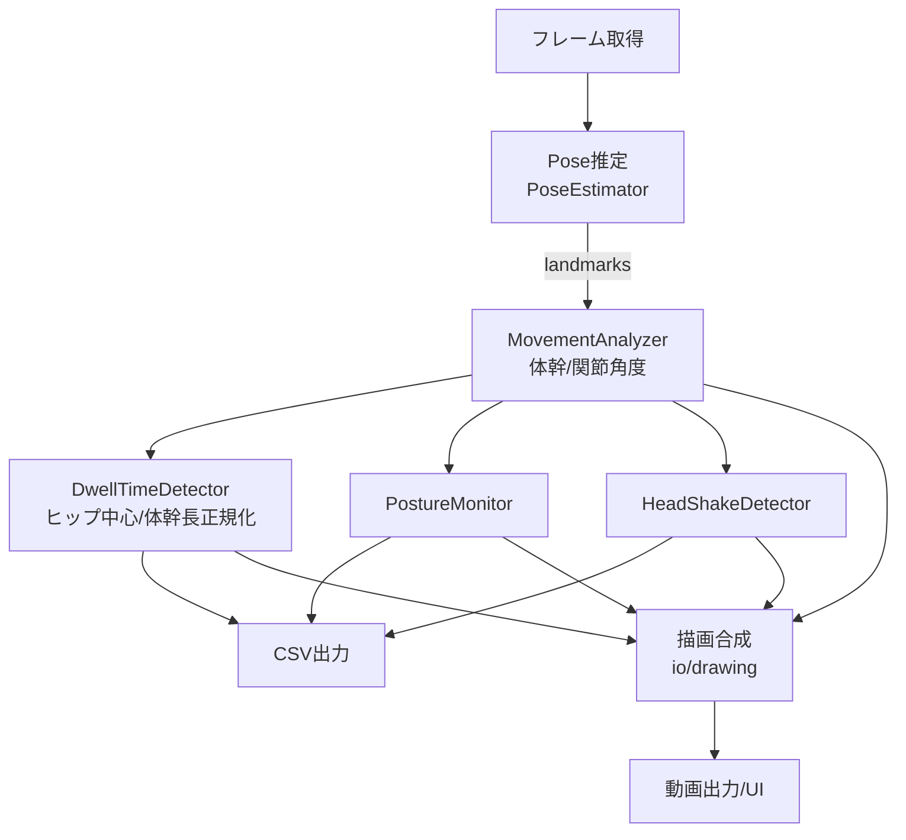
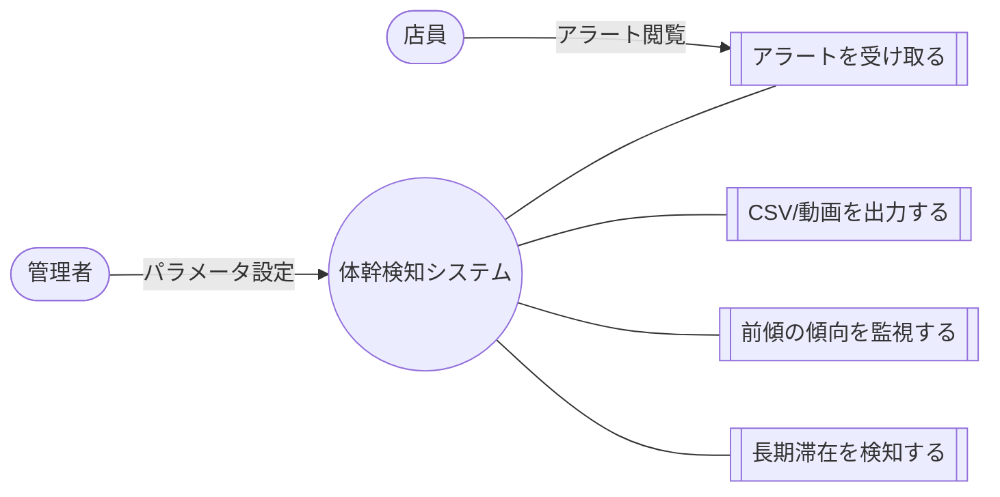
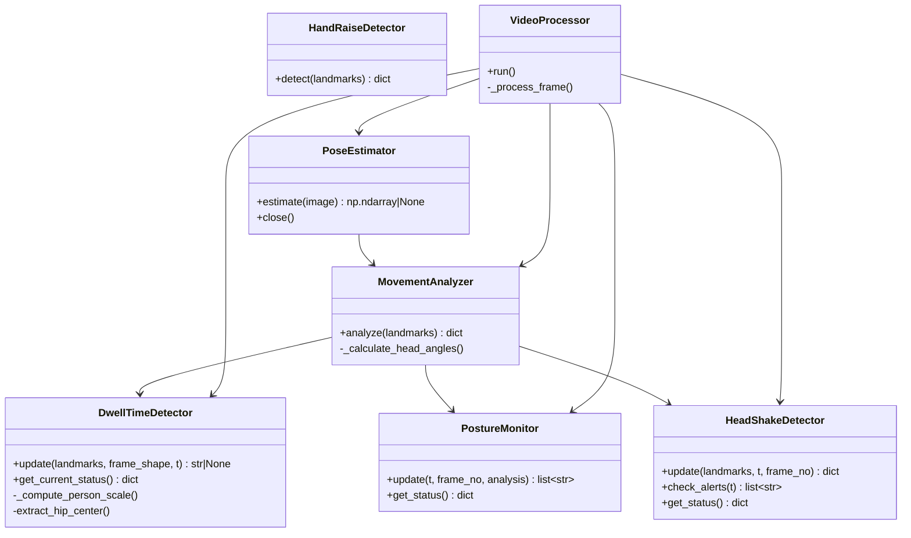
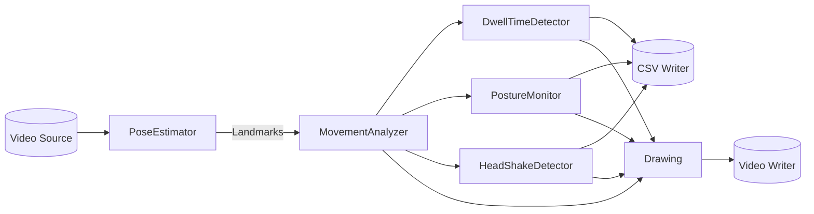
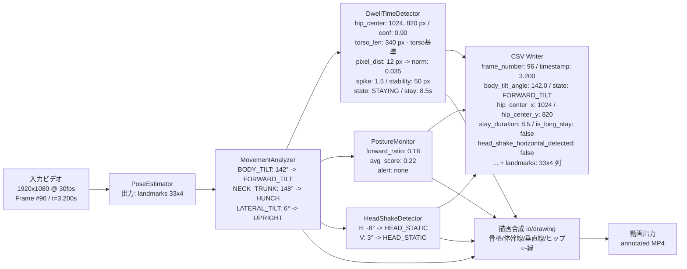
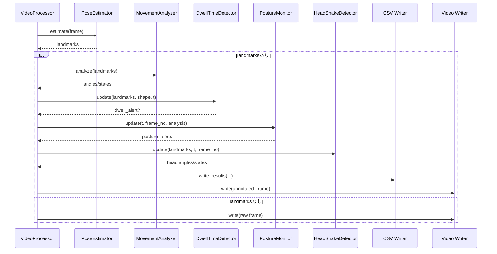

## 体幹検知アルゴリズム 設計書

この文書は、既存コードを活用して「体幹（トルソー）検知」を中心にした長期滞在検知と姿勢（前傾・側屈・猫背等）の分析アルゴリズムを設計・説明します。コード参照は `src/analysis/dwell_time_detector.py`、`src/movement_analyzer.py`、`src/pose/definitions.py`、`src/pose/utils.py`、`src/io/*.py`、`src/video_processor.py`、`src/main_detector.py`、`src/run_hand_raise.py` を主とします。

### 対象コンポーネント（主要ファイル）
- `src/analysis/dwell_time_detector.py`: 腰中心（ヒップ）に基づく長期滞在検知（体幹長正規化オプション含む）
- `src/movement_analyzer.py`: 体幹傾き（BODY_TILT）、頸部-体幹角度（NECK_TRUNK_ANGLE）、側屈（LATERAL_TILT）ほか各関節角度
- `src/pose/definitions.py`, `src/definitions.py`: ランドマーク・角度・状態の定義（Enum）
- `src/pose/utils.py`: 角度計算・中点計算ユーティリティ
- `src/head_shake_detector.py`: 頭部の回転・うなずき（補助指標）
- `src/io/csv_writer.py`, `src/io/drawing.py`, `src/io_utils.py`: 出力スキーマと描画
- `src/video_processor.py`, `src/main_detector.py`, `src/run_hand_raise.py`: 実行パイプライン


## 要件定義

### 機能要件
- 体幹（トルソー）に関連する指標の算出
  - 体幹傾き（前傾/直立）：`Angle.BODY_TILT`（`src/movement_analyzer.py`）
  - 頸部-体幹角度（うつむき/直立）：`Angle.NECK_TRUNK_ANGLE`
  - 側屈（左傾/右傾/直立）：`Angle.LATERAL_TILT`
- ヒップ中心に基づく長期滞在検知（体幹長などで正規化可能）
  - 状態機械（STAYING / POTENTIAL_MOVE）と猶予期間（grace period）
  - スパイク検知とスケール安定性に基づく移動判定
- 出力
  - CSV（各角度・状態・滞在情報・ランドマーク座標一式）
  - 描画オーバーレイ（骨格・体幹指標・滞在状態・アラート）
  - オプションで動画ファイル
- 設定
  - 閾値・ウィンドウ・正規化基準の設定可能（`config.yaml` または CLI 引数）

### 非機能要件
- 30fps 相当での処理（標準 HD 動画で実時間処理を目標）
- 安定性と誤検出抑制（猶予期間や連続フレーム判定、正規化）
- 再現性（固定乱数は不要、主要パラメータはCSVに記録可能）
- 拡張容易性（モジュール分離、明確な入出力インターフェース）

### 入出力
- 入力：動画フレーム（OpenCV/FFmpeg）、`mediapipe` の Pose ランドマーク
- 出力：
  - CSV：角度・状態、滞在情報、ランドマーク座標（x,y,z,visibility）
  - 描画：体幹線、垂直基準線、ヒップ位置、ステータステキスト等
  - 動画：描画済みフレームの書き出し（任意）


## 拡張設計（将来拡張の方向性）

- マルチ人物対応：同時トラッキングID付与、最近傍/ROI優先の対象選択
- 3D安定化：Z成分とカメラ幾何による角度安定化、奥行き補正
- 正規化基準の自動切替：肩幅・画面高・体幹長の信頼度評価に基づく最適選択
- ROIベース長期滞在：売場棚・カウンタ等の関心領域内でのみ滞在カウント
- アラート連携：HTTP/WebSocket、MQ、ファイルドロップ等の外部通知インターフェース
- 推論最適化：ONNX/TensorRT化、バッチング、非同期キューイング


## 基本設計

### システム構成（高レベル）
- フレーム取得 → 姿勢推定（PoseEstimator） → 体幹/角度解析（MovementAnalyzer） →
  滞在判定（DwellTimeDetector）・姿勢監視（PostureMonitor）・頭部分析（HeadShakeDetector） →
  CSV/動画/UI へのシンク

### データモデル（主要）
- Landmarks: `np.ndarray` 形状 (33, 4) = [x, y, z, visibility]
- 角度列挙: `src/definitions.py::Angle`（肘/肩/股/膝、体幹傾き、頸部-体幹、側屈、頭部）
- 状態列挙: `src/definitions.py::MovementState`
- 滞在情報: `DwellTimeInfo`（`src/analysis/dwell_time_detector.py`）
- 姿勢スナップショット: `PostureSnapshot`（`src/analysis/posture_monitor.py`）

### I/O スキーマ（概要）
- CSV（`src/io/csv_writer.py`）
  - 角度・状態: `right_elbow_angle`, `right_elbow_state`, ...、`body_tilt_angle`, `lateral_tilt_state`, ...
  - 滞在: `hip_center_x`, `hip_center_y`, `stay_duration`, `hip_confidence`, `is_long_stay`, `long_stay_alert`, `hip_detector_state`
  - 姿勢/頭部: `is_forward_leaning`, `forward_lean_score`, `head_shake_*`
  - ランドマーク: 各 `PoseLandmark` に対して `NAME_x`, `NAME_y`, `NAME_z`, `NAME_visibility`
- 動画：`io_utils.setup_video_writer` により元解像度で出力

### 設定（例）
- `dwell_time_detector.stay_threshold_sec`（長期滞在とみなす秒数）
- `dwell_time_detector.advanced_detection.{spike_threshold, stability_threshold_px, grace_period_sec}`
- `dwell_time_detector.{use_normalization, normalization_base}`（`torso|shoulder|screen`）
- `posture_monitor.{monitoring_duration_sec, alert_threshold_ratio}`


## 詳細設計（アルゴリズム）

### 1) 体幹スケール（正規化）
- 基準 `normalization_base`:
  - torso: 両肩中点と両腰中点の距離（画素）
  - shoulder: 両肩間距離（画素）
  - screen: 画面高さ（画素）
- 実装: `DwellTimeDetector._compute_person_scale(landmarks, frame_shape)`
  - 可視性 `visibility >= confidence_threshold` を満たすキーポイントのみ使用
  - 0除算・IndexError は None でフォールバック

### 2) ヒップ中心抽出
- 左右の腰ランドマーク（LEFT_HIP/RIGHT_HIP）の可視性判定
- 両方可視: 中点を採用、信頼度は平均
- 片方のみ可視: その腰座標を採用
- 実装: `DwellTimeDetector.extract_hip_center`

### 3) 長期滞在検知（状態機械）
- 状態: STAYING → POTENTIAL_MOVE（移動疑い） → STAYING
- 入力メトリクス
  - `pixel_dist = ||hip_current - hip_last||`
  - `norm_dist = pixel_dist / person_scale`（正規化有効時）
  - スパイク検知: 過去窓の `max(norm_dist) >= spike_threshold`
  - スケール安定性: `std(scale_history) > stability_threshold_px` → 不安定
- POTENTIAL_MOVE の猶予期間 `grace_period_sec` で移動割合が `confirmation_ratio` 以上なら移動確定（リセット）、未満なら誤報とみなし復帰
- 実装: `DwellTimeDetector.update`

### 4) 体幹指標の計算（`MovementAnalyzer`）
- BODY_TILT（前傾）
  - 両肩中点 `S` と両腰中点 `H` の3D座標から、`∠(S-H, 垂直ベクトル)` を算出
  - `<= 150°` で前傾、他は直立
- NECK_TRUNK_ANGLE（うつむき）
  - `∠(hip_mid, shoulder_mid, nose)` を3Dで算出
  - `<= 150°` で猫背、それ以外は直立
- LATERAL_TILT（側屈）
  - 2D（正規化 x,y）で肩線・腰線の傾斜角を `atan2` から算出し平均傾斜の絶対値
  - `>= 10°` を閾値にし、符号で左右判定

### 5) アラート・可視化
- `io/drawing.py` にて FPS/指標テキスト、体幹線、垂直基準線、ヒップ位置、姿勢統計などを描画
- 長期滞在成立時（初回）に通知メッセージを生成可能（例：店員呼出）


## フローチャート（全体処理）




## ユースケース図（概念）




## スキーマ

### CSV（抜粋）
- 角度/状態: `<angle>_angle`, `<angle>_state` for all `Angle`
- 体幹系: `body_tilt_angle`, `body_tilt_state`, `neck_trunk_angle_angle`, `neck_trunk_angle_state`,
  `lateral_tilt_angle`, `lateral_tilt_state`
- 滞在: `hip_center_x`, `hip_center_y`, `stay_duration`, `hip_confidence`, `is_long_stay`, `long_stay_alert`, `hip_detector_state`
- 姿勢監視: `is_forward_leaning`, `forward_lean_score`, `forward_lean_ratio`, `avg_forward_lean_score`
- 頭部: `head_horizontal_rotation_angle`, `head_horizontal_rotation_state`, `head_vertical_nod_angle`, `head_vertical_nod_state`, `head_shake_*`
- ランドマーク: `NAME_x`, `NAME_y`, `NAME_z`, `NAME_visibility`（全33点）

### ランタイム状態（例）
- `DwellTimeDetector.get_current_status()`
  - `hip_position: tuple[float, float] | None`
  - `stay_duration: float`
  - `confidence: float`
  - `is_long_stay: bool`
  - `state: str`（`STAYING|POTENTIAL_MOVE`）

### 設定（例：config.yaml）
```yaml
dwell_time_detector:
  stay_threshold_sec: 10.0
  confidence_threshold: 0.5
  advanced_detection:
    spike_threshold: 1.5
    stability_threshold_px: 50.0
    grace_period_sec: 1.5
  use_normalization: true
  normalization_base: torso  # torso|shoulder|screen
posture_monitor:
  monitoring_duration_sec: 60.0
  alert_threshold_ratio: 0.7
```


## クラス図（主要クラス）




## データフロー図




## データフロー図（数値例付き）




## シーケンス図（1フレーム処理）




## 実装対応表（主要関数・クラスと責務）

- `src/analysis/dwell_time_detector.py`
  - 体幹長/肩幅/画面高さによるスケール計算、ヒップ中心抽出、状態機械、アラート生成
- `src/movement_analyzer.py`
  - BODY_TILT / NECK_TRUNK_ANGLE / LATERAL_TILT の算出と状態判定
- `src/io/csv_writer.py`, `src/io/drawing.py`
  - CSV スキーマ、描画（体幹線・垂直線・ヒップ位置・姿勢統計など）
- `src/video_processor.py`, `src/main_detector.py`, `src/run_hand_raise.py`
  - パイプライン構築・実行、設定受け渡し、シンク（CSV/動画/UI）


## テスト観点（抜粋）

- 異常値・欠損ランドマーク：`visibility < threshold`、IndexError の安全動作
- 正規化切替テスト：`torso|shoulder|screen` 切替で異常なく動作
- 閾値回りの判定：`150°` や `10°` の境界で期待どおりの状態
- 滞在検知の誤検知抑制：猶予期間・連続窓のチューニング
- スループット：代表動画で所要時間・FPS を測定


## 備考

- 本設計は既存実装を基礎にしており、体幹中心の指標・長期滞在判定はそのまま再利用できます。
- 追加の要求（マルチ人物、通知連携、評価指標など）は拡張設計に沿って増築可能です。


