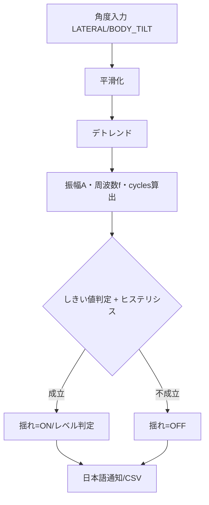

## 体幹の左右・前後揺れ検知 設計

### 目的
- `Angle.LATERAL_TILT`（側屈）と `Angle.BODY_TILT`（体幹傾き）から、体幹の左右揺れ・前後揺れを検出する。
- 常時評価（STAYINGゲートに依存せず）、ヒステリシスと最小往復回数で誤検知を抑制。
- 日本語通知（PIL描画）とCSV出力を統合する。

### 入力
- 角度系列（フレーム毎）
  - 左右：`Angle.LATERAL_TILT` の角度（度）
  - 前後：`ap_delta = 180 - BODY_TILT` を揺れ量とする（直立=0付近）
- タイムスタンプ `t`（秒）、FPS

### 前処理
- 平滑化：移動平均（推奨 0.5秒）
- デトレンド：窓内中央値を減算（基準姿勢のずれを除去）

### 特徴量と判定
- 振幅 A（度）：`0.5 * (P95 - P5)`
- 周波数 f（Hz）：ゼロクロスから往復回数 cycles を求め、`f = cycles / duration`
- 判定条件：`A >= A_th` かつ `f_min <= f <= f_max` かつ `cycles >= min_cycles`
- ヒステリシス：
  - ON確定：条件成立が連続 `t_on` 秒以上
  - OFF確定：条件不成立が連続 `t_off` 秒以上

### 推奨パラメータ（初期値）
- FPS：30
- 解析窓：8秒、平滑：0.5秒
- 周波数帯：0.2–1.5 Hz、最小往復回数：3
- 振幅しきい値：左右 10°、前後 8°
- ヒステリシス：ON 1.2秒 / OFF 0.7秒

### 出力
- `{"lateral": {amp, freq, cycles, sway, level}, "ap": {...}}`
- level 区分（例）：
  - 左右：小(10–12°) / 中(12–18°) / 大(>18°)
  - 前後：小(8–10°) / 中(10–15°) / 大(>15°)

### 日本語通知（例）
- 左右：「体幹：左右揺れ 中（10.4° / 0.6Hz）」
- 前後：「体幹：前後揺れ 大（16.2° / 0.8Hz）（継続中）」

### フローチャート

### 実装ポイント
- 新規 `src/analysis/torso_sway_detector.py` に検出器を実装。
- `video_processor` で更新し、`io/drawing.py` に日本語通知描画を追加。
- `io/csv_writer.py` に `torso_sway_*` 列を追加し書き込み。

